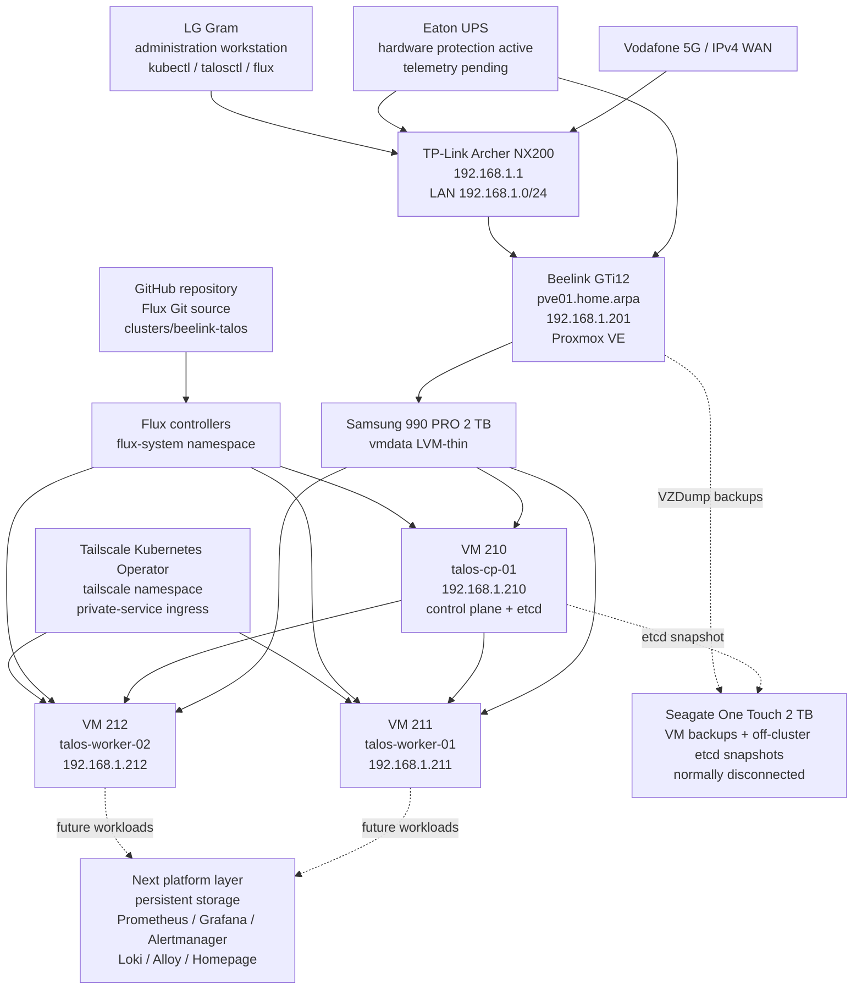

# DGS Private Cloud

Infrastructure-as-code, GitOps configuration, architecture decisions, inventories, recovery procedures, and operating documentation for the DGS home-lab/private-cloud platform.

> **Current stage:** a three-node Talos Linux Kubernetes cluster is operational on the standalone Proxmox VE host `pve01`. Flux continuously reconciles the cluster from this repository, the Tailscale Kubernetes Operator is connected to the tailnet, two off-cluster etcd snapshots have been verified, and full Proxmox backups of VMs `210`, `211`, and `212` have been written to removable storage.

## Current verified state

| Item | Current value |
|---|---|
| Last verified | `2026-08-02` |
| Active Proxmox node | `pve01` on Beelink GTi12 |
| Proxmox management address | `192.168.1.201/24` |
| Proxmox VE Manager | `9.2.5` observed in the web interface |
| Proxmox topology | One standalone physical host |
| Primary guest storage | Samsung 990 PRO 2 TB as `vmdata` |
| Talos version | `v1.13.6` |
| Kubernetes version | `v1.36.2` |
| Kubernetes topology | One control plane and two workers |
| Kubernetes node state | All three nodes `Ready` |
| CNI | Flannel |
| etcd | Healthy, single control-plane member |
| etcd recovery baseline | Two off-cluster snapshots with SHA-256 verification |
| Proxmox VM backups | VMs `210`, `211`, and `212` backed up on `2026-08-01` |
| Backup media state | `usb-backup-2tb` safely disabled, unmounted, and disconnected |
| GitOps | Flux `v2.9.3` bootstrapped from `clusters/beelink-talos` |
| Private access | Tailscale Operator chart `1.98.9` connected and healthy |
| Secret encryption | SOPS with age not yet configured |
| Kubernetes persistent storage | Not yet deployed |
| Observability and Homepage | Not yet deployed |

## Active Talos Kubernetes topology

| VM | VM ID | Role | Address | vCPU | RAM | System disk |
|---|---:|---|---|---:|---:|---:|
| `talos-cp-01` | 210 | Control plane and etcd | `192.168.1.210` | 4 | 8 GiB | 64 GiB |
| `talos-worker-01` | 211 | Worker | `192.168.1.211` | 4 | 8 GiB | 64 GiB |
| `talos-worker-02` | 212 | Worker | `192.168.1.212` | 4 | 8 GiB | 64 GiB |

All VM disks are on `vmdata`, all network interfaces use VirtIO on `vmbr0`, and all three VMs boot from `scsi0`. The Talos installation ISO is detached from every VM.

## Platform architecture



## Completed milestones

- Installed and validated Proxmox VE on `pve01`.
- Configured the management bridge at `192.168.1.201/24`.
- Prepared the Samsung 990 PRO as `vmdata` LVM-thin storage.
- Corrected the Archer NX200 IPv4 WAN configuration.
- Completed and retired the temporary ASUS Proxmox experiment without forming a cluster.
- Created and retired disposable Ubuntu validation VM `100`.
- Installed and verified workstation tooling including `kubectl`, `talosctl`, and `flux`.
- Created Talos VMs `210`, `211`, and `212`.
- Applied Talos machine configurations and bootstrapped Kubernetes exactly once.
- Confirmed all three Kubernetes nodes are `Ready`.
- Validated CoreDNS, Flannel, kube-proxy, control-plane components, and worker scheduling.
- Created and SHA-256-verified off-cluster etcd snapshots on `2026-07-26` and `2026-08-01`.
- Configured the Seagate One Touch 2 TB as `usb-backup-2tb`.
- Completed full Proxmox backups of VMs `210`, `211`, and `212`.
- Safely disabled, unmounted, and disconnected the removable backup disk.
- Bootstrapped Flux `v2.9.3` against the private GitHub repository by SSH deploy key.
- Added the active GitOps cluster path at `clusters/beelink-talos`.
- Deployed the Tailscale Kubernetes Operator through Flux using chart `1.98.9`.
- Confirmed the operator Deployment and pod are healthy with zero restarts.
- Confirmed the `tailscale` IngressClass and Tailscale CRDs are installed.
- Confirmed `beelink-talos-operator` is connected in the Tailscale admin console with `tag:k8s-operator`.

## Quick validation

```powershell
$CP = "192.168.1.210"
$W1 = "192.168.1.211"
$W2 = "192.168.1.212"

$env:TALOSCONFIG = (Resolve-Path ".\talos\generated\talosconfig").Path
$env:KUBECONFIG = (Resolve-Path ".\talos\generated\kubeconfig").Path

talosctl health `
  --control-plane-nodes $CP `
  --worker-nodes "$W1,$W2" `
  --endpoints $CP

kubectl get nodes -o wide
kubectl get pods -A -o wide

flux check
flux get sources git -A
flux get kustomizations -A
flux get sources helm -A
flux get helmreleases -A

kubectl get deployment -n tailscale
kubectl get pods -n tailscale
kubectl get ingressclass tailscale
```

## Backup and recovery state

The recovery baseline currently contains:

- two off-cluster Talos etcd snapshots with SHA-256 files;
- full Proxmox backups of VMs `210`, `211`, and `212`;
- removable backup storage that is normally disconnected after a completed backup session.

Remaining recovery work:

1. perform an isolated VM restore test;
2. rehearse Talos disaster recovery only in an isolated environment;
3. maintain an encrypted second copy of critical Talos recovery material;
4. automate or formally schedule future snapshots and backups.

Generated Talos machine configurations, `talosconfig`, kubeconfig, etcd snapshots, VM backup archives, private keys, OAuth secrets, and decrypted secret files must never be committed.

## Immediate next work

1. Select and deploy the initial Talos-compatible persistent-storage solution.
2. Deploy Prometheus, Grafana, Alertmanager, Loki, and Grafana Alloy.
3. Expose selected dashboards privately through Tailscale.
4. Deploy Homepage.
5. Configure SOPS with age and migrate manually created Kubernetes Secrets to encrypted Git-managed resources.
6. Perform an isolated VM restore test.
7. Add Eaton UPS telemetry and graceful-shutdown monitoring.

## Repository map

```text
dgs-private-cloud/
├── README.md
├── LICENSE.md
├── AGENTS.md
├── CHANGELOG.md
├── ROADMAP.md
├── SECURITY.md
├── .gitignore
├── clusters/
│   └── beelink-talos/
│       ├── flux-system/
│       ├── tailscale/
│       └── kustomization.yaml
├── talos/
│   ├── README.md
│   ├── image-factory-schematic.yaml
│   ├── generated/              # ignored except .gitkeep
│   └── patches/
├── kubernetes/
│   ├── infrastructure/
│   └── apps/
├── docs/
│   ├── 00-project-overview.md
│   ├── 01-current-state.md
│   ├── 02-hardware-and-bios.md
│   ├── 03-proxmox-installation.md
│   ├── 04-networking.md
│   ├── 05-router-ipv4-recovery.md
│   ├── 06-repositories-and-updates.md
│   ├── 07-storage-configuration.md
│   ├── 08-validation.md
│   ├── 09-operations.md
│   ├── 10-next-steps.md
│   ├── 11-temporary-asus-node.md
│   ├── 12-first-ubuntu-vm.md
│   ├── 13-talos-kubernetes-phase1.md
│   ├── 14-talos-kubernetes-cluster-bootstrap.md
│   ├── 15-flux-and-tailscale-operator.md
│   ├── decisions/
│   └── runbooks/
│       ├── flux-and-tailscale-validation.md
│       ├── talos-phase1-workers-and-bootstrap.md
│       └── talos-etcd-snapshot.md
├── inventory/
│   ├── host.yaml
│   ├── network.yaml
│   ├── storage.yaml
│   ├── power.yaml
│   ├── guests.yaml
│   └── kubernetes.yaml
├── scripts/
│   └── workstation/
│       └── New-TalosEtcdSnapshot.ps1
└── evidence/
```

## Documentation index

1. [Project overview](docs/00-project-overview.md)
2. [Current state](docs/01-current-state.md)
3. [Hardware and BIOS](docs/02-hardware-and-bios.md)
4. [Proxmox installation](docs/03-proxmox-installation.md)
5. [Management networking](docs/04-networking.md)
6. [Archer NX200 IPv4 recovery](docs/05-router-ipv4-recovery.md)
7. [Repositories and updates](docs/06-repositories-and-updates.md)
8. [Samsung storage configuration](docs/07-storage-configuration.md)
9. [Validation evidence](docs/08-validation.md)
10. [Operations](docs/09-operations.md)
11. [Next steps](docs/10-next-steps.md)
12. [Retired ASUS experiment](docs/11-temporary-asus-node.md)
13. [First Ubuntu VM lifecycle](docs/12-first-ubuntu-vm.md)
14. [Talos Phase 1 prerequisites](docs/13-talos-kubernetes-phase1.md)
15. [Talos Kubernetes cluster bootstrap](docs/14-talos-kubernetes-cluster-bootstrap.md)
16. [Flux and Tailscale Operator](docs/15-flux-and-tailscale-operator.md)
17. [Flux and Tailscale validation runbook](docs/runbooks/flux-and-tailscale-validation.md)
18. [Talos workers and bootstrap runbook](docs/runbooks/talos-phase1-workers-and-bootstrap.md)
19. [Talos etcd snapshot runbook](docs/runbooks/talos-etcd-snapshot.md)

## Security boundary

Proxmox management, the Talos API, the Kubernetes API, and observability endpoints remain private. Do not expose TCP `8006`, TCP `50000`, TCP `6443`, SSH, or dashboards directly to the public internet.

Never commit:

- Talos-generated machine configurations;
- `talosconfig` or kubeconfig;
- etcd snapshots;
- age private keys;
- decrypted SOPS files;
- Tailscale OAuth client IDs or secrets;
- the `operator-oauth` Secret manifest in plaintext;
- passwords, tokens, private keys, or VPN profiles;
- VM backup archives, virtual disks, ISO images, or router exports.

## Licence

Copyright © 2026 Duminda Sumanasinghe. All rights reserved.

This is proprietary project documentation. See [LICENSE.md](LICENSE.md).
