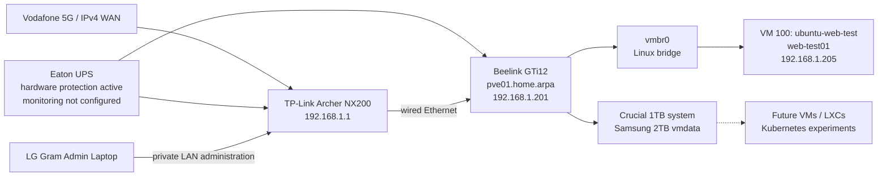

# DGS Private Cloud

Infrastructure-as-code and operations documentation for the **DGS home-lab/private-cloud platform**.

The active platform is currently a **single standalone Proxmox VE node** named `pve01`, running on a Beelink GTi12. The temporary ASUS Proxmox experiment was ended without forming a cluster, and the laptop has returned to desktop use with Zorin OS.

> **Current stage:** the first Ubuntu Server VM has been created on `pve01`, validated with QEMU Guest Agent and Nginx, assigned the reserved LAN address `192.168.1.205`, and retained as a stopped/startable test workload.

## Current verified state

| Item | Value |
|---|---|
| Active Proxmox topology | One standalone node |
| Main node | `pve01` |
| Platform | Beelink GTi12 |
| Management URL | `https://192.168.1.201:8006` |
| Management address | `192.168.1.201/24` |
| Gateway / DNS | `192.168.1.1` |
| PVE Manager | `9.2.4` |
| System disk | Crucial `CT1000P3PSSD8` 1TB |
| Primary guest storage | Samsung SSD 990 PRO 2TB as `vmdata` |
| Provisioned guests | One VM |
| Cluster state | Standalone; no cluster created |
| Last verified | 2026-07-21 |

## First validated guest

| Property | Value |
|---|---|
| Proxmox VM ID | `100` |
| Proxmox name | `ubuntu-web-test` |
| Guest hostname | `web-test01` |
| Operating system | Ubuntu Server 26.04 LTS |
| vCPU | 2 |
| Memory | 4GiB |
| Virtual disk | 32GiB on `vmdata` |
| Network bridge | `vmbr0` |
| Addressing | DHCP with Archer NX200 reservation |
| Reserved address | `192.168.1.205` |
| Guest integration | QEMU Guest Agent active |
| Test service | Nginx |
| Validation URL | `http://192.168.1.205` |
| Autostart | Disabled |

## Architecture



## Repository map

```text
dgs-private-cloud/
├── README.md
├── LICENSE.md
├── AGENTS.md
├── CHANGELOG.md
├── ROADMAP.md
├── SECURITY.md
├── .gitignore
├── docs/
│   ├── 00-project-overview.md
│   ├── 01-current-state.md
│   ├── 02-hardware-and-bios.md
│   ├── 03-proxmox-installation.md
│   ├── 04-networking.md
│   ├── 05-router-ipv4-recovery.md
│   ├── 06-repositories-and-updates.md
│   ├── 07-storage-configuration.md
│   ├── 08-validation.md
│   ├── 09-operations.md
│   ├── 10-next-steps.md
│   ├── 11-temporary-asus-node.md
│   ├── 12-first-ubuntu-vm.md
│   ├── diagrams/
│   ├── decisions/
│   │   ├── ADR-004-temporary-two-node-cluster.md
│   │   └── ADR-005-single-node-first-guest-validation.md
│   └── runbooks/
│       └── remove-temporary-asus-node.md
├── inventory/
│   ├── host.yaml
│   ├── network.yaml
│   ├── power.yaml
│   ├── storage.yaml
│   └── guests.yaml
├── scripts/
├── evidence/
└── .github/
```

## Completed work

- Confirmed BIOS virtualisation settings on `pve01`.
- Installed Proxmox VE on the Beelink Crucial 1TB SSD.
- Preserved and prepared the Samsung 990 PRO 2TB SSD as `vmdata`.
- Configured static management networking for `pve01` at `192.168.1.201/24`.
- Corrected the Archer NX200 IPv4 WAN problem with a dedicated Vodafone IPv4 profile.
- Enabled the Proxmox no-subscription repository and disabled enterprise repositories.
- Updated `pve01` and confirmed PVE Manager `9.2.4`.
- Created and validated `vg_vmdata`, `thin_vmdata`, and Proxmox storage ID `vmdata`.
- Evaluated the legacy ASUS laptop as a temporary Proxmox node, then ended the experiment without creating a cluster.
- Returned the ASUS laptop to desktop use with Zorin OS.
- Uploaded the Ubuntu Server 26.04 LTS ISO to `local`.
- Created VM `100` (`ubuntu-web-test`) with 2 vCPU, 4GiB RAM, and a 32GiB disk on `vmdata`.
- Installed and validated Ubuntu Server, OpenSSH, Nginx, curl, and QEMU Guest Agent.
- Created and served a test page from `/var/www/html/index.html`.
- Reserved `192.168.1.205` for `web-test01` through the Archer NX200.
- Verified web access, SSH/SCP access, clean guest shutdown, guest restart, and safe host shutdown.

## Pending work

- Create and validate a VM snapshot and rollback.
- Configure scheduled backups and test a full restore.
- Configure UPS monitoring and automated graceful shutdown.
- Create a reusable Ubuntu VM template.
- Define permanent second and third Proxmox nodes.
- Deploy Kubernetes nodes.
- Document private remote administration.
- Add security hardening such as named administration, SSH keys, 2FA, and firewall policy.

## Documentation index

1. [Project overview](docs/00-project-overview.md)
2. [Current state](docs/01-current-state.md)
3. [Hardware and BIOS](docs/02-hardware-and-bios.md)
4. [Proxmox installation](docs/03-proxmox-installation.md)
5. [Management networking](docs/04-networking.md)
6. [Archer NX200 IPv4 recovery](docs/05-router-ipv4-recovery.md)
7. [Repositories and updates](docs/06-repositories-and-updates.md)
8. [Samsung storage configuration](docs/07-storage-configuration.md)
9. [Validation evidence](docs/08-validation.md)
10. [Operations](docs/09-operations.md)
11. [Next steps](docs/10-next-steps.md)
12. [Temporary ASUS experiment history](docs/11-temporary-asus-node.md)
13. [First Ubuntu VM validation](docs/12-first-ubuntu-vm.md)
14. [Temporary node removal runbook](docs/runbooks/remove-temporary-asus-node.md)

## Routine commands

Proxmox host:

```bash
pveversion -v
systemctl --failed
pvesm status
qm list
qm status 100
ip -br address
ip route
hostname -f
timedatectl
```

Ubuntu guest:

```bash
hostname -I
systemctl is-active nginx
systemctl is-active qemu-guest-agent
curl -I http://localhost
```

## Security boundary

The Proxmox management interface is private. Do not expose these ports directly to the internet:

```text
TCP 8006  Proxmox web interface
TCP 22    SSH
TCP 3128  SPICE proxy
```

Do not commit passwords, private keys, tokens, VPN profiles, SIM identifiers, public-IP screenshots, unredacted router exports, backup archives, VM disk images, or uniquely identifying hardware details that are not operationally necessary.

## Licence

Copyright © 2026 Duminda Sumanasinghe. All rights reserved.

This repository is publicly visible for reference but remains proprietary. See [LICENSE](LICENSE.md).