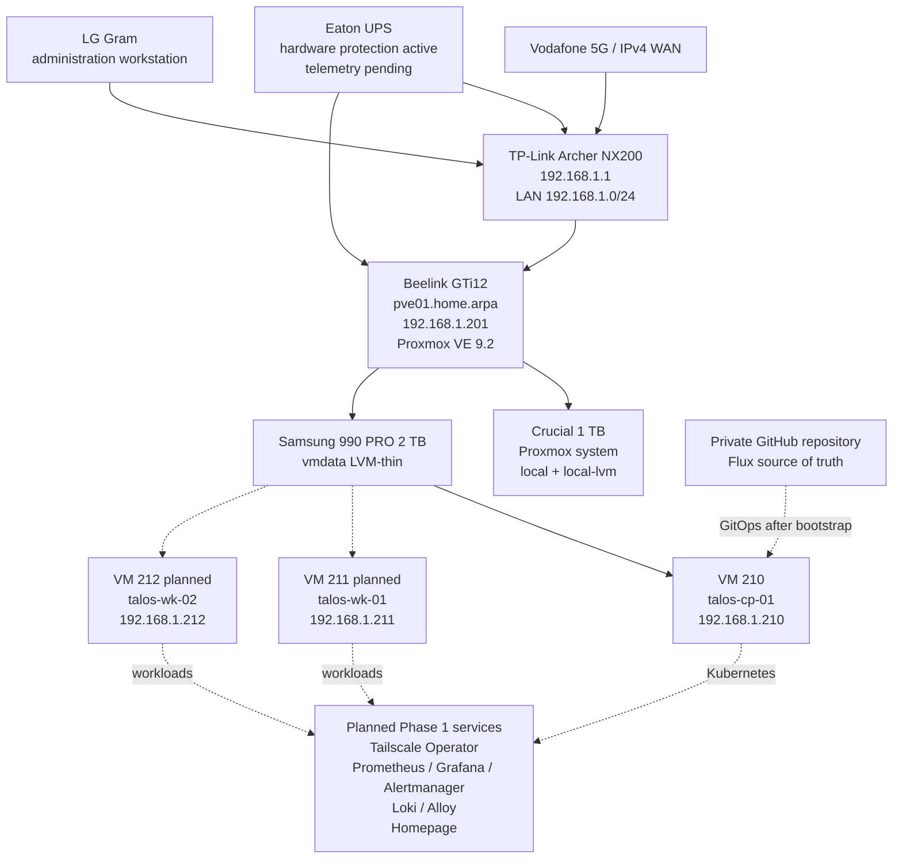

# DGS Private Cloud

Infrastructure-as-code, GitOps configuration, architecture decisions, inventories, and operations documentation for the DGS home-lab/private-cloud platform.

> **Current stage:** the Beelink `pve01` node is the active standalone Proxmox VE platform. The obsolete Ubuntu validation VM and temporary ASUS-node experiment have been retired. Talos Linux control-plane VM `210` is running in maintenance mode and the two worker VMs are the next implementation task.

## Current verified state

| Item | Current value |
|---|---|
| Active Proxmox node | `pve01` on Beelink GTi12 |
| Management address | `192.168.1.201/24` |
| Proxmox VE Manager | `9.2.5` observed in the web interface |
| Cluster state | Standalone Proxmox node |
| Primary guest storage | Samsung 990 PRO 2 TB as `vmdata` |
| Temporary ASUS node | Retired from the active design; no Proxmox cluster was formed |
| Ubuntu validation VM | VM `100` removed with its virtual disks |
| Talos control plane | VM `210`, `talos-cp-01`, `192.168.1.210` |
| Talos state | Talos `v1.13.6`, maintenance mode, ready |
| Kubernetes state | Not yet bootstrapped |
| GitOps state | Repository structure prepared; Flux not yet bootstrapped |
| Last verified | 2026-07-25 |

## Phase 1 target

The initial single-host Kubernetes platform will use three Talos VMs on `pve01`.

| VM | VM ID | Role | Address | vCPU | RAM | Disks |
|---|---:|---|---|---:|---:|---|
| `talos-cp-01` | 210 | Control plane | `192.168.1.210` | 4 | 8 GiB | 64 GiB system |
| `talos-wk-01` | 211 | Worker | `192.168.1.211` | 6 | 14 GiB | 64 GiB system + 300 GiB data |
| `talos-wk-02` | 212 | Worker | `192.168.1.212` | 6 | 14 GiB | 64 GiB system + 300 GiB data |

`192.168.1.220` is reserved for a future Kubernetes API virtual IP. It is not used by the current single-control-plane design.

## Architecture



## Completed work

- Installed and validated Proxmox VE on `pve01`.
- Configured `192.168.1.201/24` on bridge `vmbr0`.
- Prepared the Samsung 990 PRO as `vmdata`.
- Corrected the Archer NX200 IPv4 WAN configuration.
- Enabled the Proxmox no-subscription repository policy.
- Completed and retired the temporary ASUS Proxmox experiment without forming a cluster.
- Created, validated, and then removed disposable Ubuntu VM `100`.
- Installed and verified the Windows administration tools: GitHub CLI, `kubectl`, `talosctl`, Flux CLI, SOPS, and age.
- Generated a Talos `v1.13.6` Image Factory ISO containing `siderolabs/qemu-guest-agent`.
- Uploaded the ISO and verified identical SHA-256 values on the LG Gram and `pve01`.
- Created Talos control-plane VM `210`.
- Reserved `192.168.1.210` and verified ICMP and Talos API TCP `50000`.
- Confirmed the Talos installation target is `/dev/sda`.

## Immediate next work

1. Create Talos workers VM `211` and VM `212`.
2. Reserve `192.168.1.211` and `192.168.1.212`.
3. Confirm each worker’s 64 GiB system disk and 300 GiB data disk.
4. Generate Talos machine configuration without committing generated credentials.
5. Apply the control-plane and worker configurations.
6. Bootstrap Kubernetes exactly once.
7. Retrieve kubeconfig and confirm all three nodes are `Ready`.
8. Bootstrap Flux.
9. Configure SOPS with age.
10. Deploy Tailscale Operator, observability, logging, and Homepage.

## Repository map

```text
dgs-private-cloud/
├── README.md
├── LICENSE.md
├── AGENTS.md
├── CHANGELOG.md
├── ROADMAP.md
├── SECURITY.md
├── .gitignore
├── clusters/
│   └── home/
├── talos/
│   ├── README.md
│   ├── image-factory-schematic.yaml
│   ├── generated/              # ignored except .gitkeep
│   └── patches/
├── kubernetes/
│   ├── infrastructure/
│   │   ├── storage/local-path/
│   │   ├── tailscale-operator/
│   │   ├── monitoring/
│   │   └── logging/
│   └── apps/homepage/
├── docs/
│   ├── 00-project-overview.md
│   ├── 01-current-state.md
│   ├── 02-hardware-and-bios.md
│   ├── 03-proxmox-installation.md
│   ├── 04-networking.md
│   ├── 05-router-ipv4-recovery.md
│   ├── 06-repositories-and-updates.md
│   ├── 07-storage-configuration.md
│   ├── 08-validation.md
│   ├── 09-operations.md
│   ├── 10-next-steps.md
│   ├── 11-temporary-asus-node.md
│   ├── 12-first-ubuntu-vm.md
│   ├── 13-talos-kubernetes-phase1.md
│   ├── decisions/
│   └── runbooks/
├── inventory/
├── scripts/
├── evidence/
└── .github/
```

## Documentation index

1. [Project overview](docs/00-project-overview.md)
2. [Current state](docs/01-current-state.md)
3. [Hardware and BIOS](docs/02-hardware-and-bios.md)
4. [Proxmox installation](docs/03-proxmox-installation.md)
5. [Management networking](docs/04-networking.md)
6. [Archer NX200 IPv4 recovery](docs/05-router-ipv4-recovery.md)
7. [Repositories and updates](docs/06-repositories-and-updates.md)
8. [Samsung storage configuration](docs/07-storage-configuration.md)
9. [Validation evidence](docs/08-validation.md)
10. [Operations](docs/09-operations.md)
11. [Next steps](docs/10-next-steps.md)
12. [Retired ASUS experiment](docs/11-temporary-asus-node.md)
13. [First Ubuntu VM lifecycle](docs/12-first-ubuntu-vm.md)
14. [Talos Kubernetes Phase 1](docs/13-talos-kubernetes-phase1.md)
15. [Talos worker and bootstrap runbook](docs/runbooks/talos-phase1-workers-and-bootstrap.md)

## Security boundary

Proxmox management remains private. Do not expose TCP `8006`, SSH, the Talos API, Kubernetes API, Prometheus, Alertmanager, or Loki directly to the public internet.

Never commit:

- Talos-generated machine configurations,
- `talosconfig` or kubeconfig,
- age private keys,
- decrypted SOPS files,
- OAuth clients or Tailscale credentials,
- passwords, tokens, private keys, VPN profiles,
- backup archives, VM disks, ISO images, or router exports.

## Licence

Copyright © 2026 Duminda Sumanasinghe. All rights reserved.

This is a proprietary repository intended to remain private. See [LICENSE](LICENSE.md).
