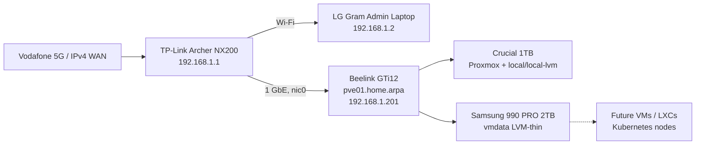

# DGS Private Cloud

Private infrastructure-as-code and operations documentation for the **DGS home-lab/private-cloud platform**.

The first completed node is a **Beelink GTi12** running **Proxmox VE 9.2**. The host is installed, updated, reachable through the private LAN, and has separate system and VM storage. No virtual machines or containers have been created yet.

> **Current stage:** Proxmox host operational, network repaired, repositories configured, Samsung VM storage ready, zero guests deployed.

## Current verified state

| Item | Verified value |
|---|---|
| Node | `pve01` |
| FQDN | `pve01.home.arpa` |
| Management URL | `https://192.168.1.201:8006` |
| Management address | `192.168.1.201/24` |
| Gateway / DNS | `192.168.1.1` |
| Management NIC | `nic0` |
| Management NIC MAC | `B0:41:6F:12:9A:69` |
| Proxmox VE | `9.2.0` |
| PVE Manager | `9.2.4` |
| Running kernel | `7.0.14-4-pve` |
| Failed systemd units | `0` |
| System disk | Crucial `CT1000P3PSSD8` 1TB |
| Primary guest storage | Samsung SSD 990 PRO 2TB |
| Primary guest storage ID | `vmdata` |
| Guests | None |
| Last verified | 2026-07-11 |

## Architecture



## Repository map

```text
dgs-private-cloud/
├── README.md
├── LICENSE.md
├── AGENTS.md
├── CHANGELOG.md
├── ROADMAP.md
├── SECURITY.md
├── .gitignore
├── docs/
│   ├── 00-project-overview.md
│   ├── 01-current-state.md
│   ├── 02-hardware-and-bios.md
│   ├── 03-proxmox-installation.md
│   ├── 04-networking.md
│   ├── 05-router-ipv4-recovery.md
│   ├── 06-repositories-and-updates.md
│   ├── 07-storage-configuration.md
│   ├── 08-validation.md
│   ├── 09-operations.md
│   ├── 10-next-steps.md
│   ├── diagrams/
│   ├── decisions/
│   └── runbooks/
├── inventory/
├── scripts/
├── evidence/
└── .github/
```

## Completed work

- Confirmed BIOS virtualization settings.
- Installed Proxmox VE on the Crucial 1TB SSD.
- Preserved and prepared the Samsung 990 PRO 2TB SSD for workloads.
- Configured static management networking.
- Corrected the Archer NX200 IPv4 WAN problem by creating a dedicated Vodafone IPv4 profile.
- Enabled the Proxmox no-subscription repository.
- Updated Proxmox and rebooted into kernel `7.0.14-4-pve`.
- Created `vg_vmdata` and `thin_vmdata`.
- Registered `vmdata` as Proxmox LVM-thin storage.
- Extended thin-pool metadata to approximately 1.11 GiB.
- Confirmed LVM thin-pool monitoring.
- Confirmed zero failed systemd units.
- Confirmed safe headless administration and shutdown/startup procedure.

## Not completed yet

- No VM or LXC has been created.
- No cluster has been formed.
- No Kubernetes node has been deployed.
- No external backup target has been configured.
- No UPS integration has been configured.
- No remote VPN administration has been documented in this repository yet.

## Documentation index

1. [Project overview](docs/00-project-overview.md)
2. [Current state](docs/01-current-state.md)
3. [Hardware and BIOS](docs/02-hardware-and-bios.md)
4. [Proxmox installation](docs/03-proxmox-installation.md)
5. [Management networking](docs/04-networking.md)
6. [Archer NX200 IPv4 recovery](docs/05-router-ipv4-recovery.md)
7. [Repositories and updates](docs/06-repositories-and-updates.md)
8. [Samsung storage configuration](docs/07-storage-configuration.md)
9. [Validation evidence](docs/08-validation.md)
10. [Operations](docs/09-operations.md)
11. [Next steps](docs/10-next-steps.md)

## Routine commands

```bash
pveversion -v
systemctl --failed
pvesm status
ip -br address
ip route
lsblk -o NAME,SIZE,MODEL,SERIAL,FSTYPE,MOUNTPOINTS
lvs -a -o lv_name,vg_name,lv_attr,lv_size,data_percent,metadata_percent
```

## Security boundary

The Proxmox management interface is private. Do not expose these ports directly to the internet:

```text
TCP 8006  Proxmox web interface
TCP 22    SSH
TCP 3128  SPICE proxy
```

Do not commit passwords, private keys, tokens, VPN profiles, SIM identifiers, public-IP screenshots, unredacted configuration exports, or backup archives.

## License

Copyright © 2026 Duminda Sumanasinghe. All rights reserved.

This is a private and proprietary repository. See [LICENSE](LICENSE.md).
