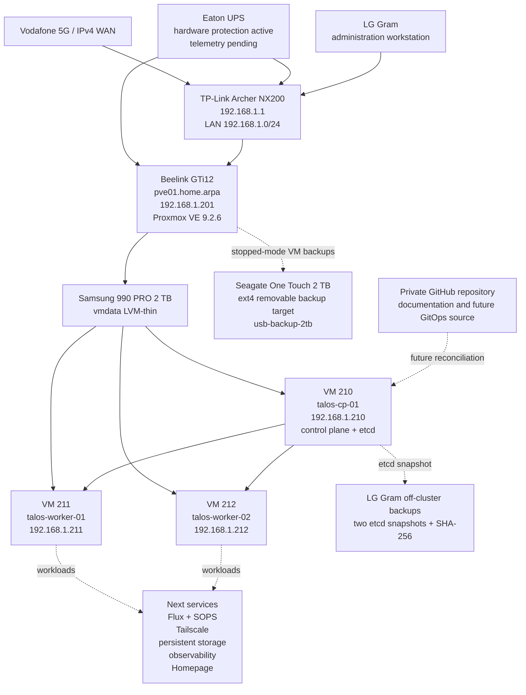

# DGS Private Cloud

Infrastructure-as-code, GitOps configuration, architecture decisions, inventories, operations runbooks, and recovery documentation for the DGS home-lab/private-cloud platform.

> **Current stage:** an operational three-node Talos Linux Kubernetes cluster runs as virtual machines on the standalone Proxmox VE host `pve01`. All Kubernetes nodes are `Ready`. A validated recovery baseline now exists: two off-cluster Talos etcd snapshots with SHA-256 files and one complete compressed Proxmox backup generation for VMs `210`, `211`, and `212` on a removable Seagate 2 TB USB HDD.

## Current verified state

| Item | Current value |
|---|---|
| Active Proxmox node | `pve01` on Beelink GTi12 |
| Proxmox management address | `192.168.1.201/24` |
| Proxmox VE Manager | `9.2.6` observed in the web interface on 2026-08-01 |
| Proxmox topology | One standalone physical host |
| Primary guest storage | Samsung 990 PRO 2 TB as `vmdata` LVM-thin |
| Talos version | `v1.13.6` |
| Kubernetes version | `v1.36.2` |
| Kubernetes topology | One control plane and two workers |
| Kubernetes node state | All three nodes `Ready` |
| CNI | Flannel |
| etcd | Healthy, single control-plane member |
| etcd snapshots | Two dated snapshots stored off-cluster with SHA-256 files |
| Proxmox VM backups | Complete baseline generation for VMs `210`, `211`, and `212` |
| External backup target | Seagate One Touch 2 TB, ext4, storage ID `usb-backup-2tb` |
| External disk state after backup | Proxmox storage disabled, filesystem unmounted, disk disconnected safely |
| Restore testing | Not yet completed |
| Flux / SOPS | Repository prepared; not yet bootstrapped |
| Last verified | 2026-08-01 |

## Active Talos Kubernetes topology

| VM | VM ID | Role | Address | vCPU | RAM | System disk |
|---|---:|---|---|---:|---:|---:|
| `talos-cp-01` | 210 | Control plane and etcd | `192.168.1.210` | 4 | 8 GiB | 64 GiB |
| `talos-worker-01` | 211 | Worker | `192.168.1.211` | 4 | 8 GiB | 64 GiB |
| `talos-worker-02` | 212 | Worker | `192.168.1.212` | 4 | 8 GiB | 64 GiB |

All VM disks are on `vmdata`, all network interfaces use VirtIO on `vmbr0`, and all three VMs boot from `scsi0`. The Talos installation ISO is detached from every virtual CD/DVD drive.

## Architecture



## Completed milestones

- Installed and validated Proxmox VE on `pve01`.
- Configured the management bridge at `192.168.1.201/24`.
- Prepared the Samsung 990 PRO as `vmdata` LVM-thin storage.
- Corrected the Archer NX200 IPv4 WAN configuration.
- Completed and retired the temporary ASUS Proxmox experiment without forming a cluster.
- Created and retired disposable Ubuntu validation VM `100`.
- Installed and verified workstation tooling including `kubectl` and `talosctl`.
- Generated and uploaded a Talos `v1.13.6` installation ISO.
- Created VM `210` and cloned worker VMs `211` and `212`.
- Reserved `192.168.1.210`, `.211`, and `.212` on the LAN.
- Generated, validated, and applied node-specific Talos configurations without committing credentials.
- Bootstrapped the control plane exactly once and retrieved kubeconfig.
- Confirmed all three Kubernetes nodes and core system components are healthy.
- Validated workload scheduling with four Nginx replicas distributed evenly across the two workers.
- Detached the Talos ISO from all three VMs.
- Created two dated Talos etcd snapshots off-cluster and generated SHA-256 files.
- Prepared a Seagate 2 TB USB HDD as ext4 directory storage with `is_mountpoint 1`.
- Created compressed full backups of VMs `210`, `211`, and `212`.
- Restarted the cluster and reconfirmed all nodes `Ready` and `talosctl health` successful.
- Disabled the external storage, flushed writes, unmounted it, and disconnected it safely.
- Configured backup retention: keep last 3, weekly 2, monthly 1.

## Backup baseline recorded on 2026-08-01

### Proxmox backup archives

| VM | Archive | Recorded size |
|---:|---|---:|
| 210 | `vzdump-qemu-210-2026_08_01-10_29_43.vma.zst` | 432.11 MiB |
| 211 | `vzdump-qemu-211-2026_08_01-10_31_58.vma.zst` | 270.95 MiB |
| 212 | `vzdump-qemu-212-2026_08_01-10_33_27.vma.zst` | 251.83 MiB |

Backup note: `Talos cluster baseline after bootstrap`.

### Talos etcd snapshots

- `dgs-homelab-etcd-2026-07-26_192642.snapshot`
- `dgs-homelab-etcd-2026-08-01_090643.snapshot`

Each snapshot has a corresponding `.sha256` file. Snapshot contents and hashes are intentionally not committed.

## Quick validation from a fresh PowerShell session

```powershell
$CP = "192.168.1.210"
$W1 = "192.168.1.211"
$W2 = "192.168.1.212"
$RepoPath = "E:\home-server\dgs-private-cloud"

$env:TALOSCONFIG = Join-Path $RepoPath "talos\generated\talosconfig"
$env:KUBECONFIG = Join-Path $RepoPath "talos\generated\kubeconfig"

talosctl health `
  --control-plane-nodes $CP `
  --worker-nodes "$W1,$W2" `
  --endpoints $CP `
  --talosconfig $env:TALOSCONFIG

kubectl get nodes -o wide
kubectl get pods -A -o wide
```

## Immediate next work

1. Perform a documented restore test using a non-production VM ID or isolated test environment.
2. Copy encrypted copies of the etcd snapshots, checksum files, `talosconfig`, kubeconfig, and machine configurations to a second physical location.
3. Automate regular etcd snapshots and define a tested retention process.
4. Decide whether the removable HDD remains manual-only or becomes a scheduled connected backup target.
5. Bootstrap Flux.
6. Configure SOPS with age and keep only encrypted secrets in Git.
7. Deploy authenticated private access with Tailscale.
8. Select the initial persistent-storage solution.
9. Deploy monitoring, logging, UPS telemetry, and Homepage.

## Repository map

```text
dgs-private-cloud/
├── README.md
├── LICENSE.md
├── AGENTS.md
├── CHANGELOG.md
├── ROADMAP.md
├── SECURITY.md
├── .gitignore
├── clusters/
│   └── home/
├── talos/
│   ├── README.md
│   ├── image-factory-schematic.yaml
│   ├── generated/              # ignored except .gitkeep
│   └── patches/
├── kubernetes/
│   ├── infrastructure/
│   └── apps/
├── docs/
│   ├── 00-project-overview.md
│   ├── 01-current-state.md
│   ├── 02-hardware-and-bios.md
│   ├── 03-proxmox-installation.md
│   ├── 04-networking.md
│   ├── 05-router-ipv4-recovery.md
│   ├── 06-repositories-and-updates.md
│   ├── 07-storage-configuration.md
│   ├── 08-validation.md
│   ├── 09-operations.md
│   ├── 10-next-steps.md
│   ├── 11-temporary-asus-node.md
│   ├── 12-first-ubuntu-vm.md
│   ├── 13-talos-kubernetes-phase1.md
│   ├── 14-talos-kubernetes-cluster-bootstrap.md
│   ├── 15-backup-and-recovery-baseline.md
│   ├── decisions/
│   └── runbooks/
│       ├── talos-phase1-workers-and-bootstrap.md
│       ├── talos-etcd-snapshot.md
│       └── proxmox-usb-vm-backup.md
├── inventory/
│   ├── host.yaml
│   ├── network.yaml
│   ├── storage.yaml
│   ├── guests.yaml
│   └── kubernetes.yaml
├── scripts/
│   └── workstation/
│       └── New-TalosEtcdSnapshot.ps1
├── evidence/
└── .github/
```

## Documentation index

1. [Project overview](docs/00-project-overview.md)
2. [Current state](docs/01-current-state.md)
3. [Hardware and BIOS](docs/02-hardware-and-bios.md)
4. [Proxmox installation](docs/03-proxmox-installation.md)
5. [Management networking](docs/04-networking.md)
6. [Archer NX200 IPv4 recovery](docs/05-router-ipv4-recovery.md)
7. [Repositories and updates](docs/06-repositories-and-updates.md)
8. [Storage configuration](docs/07-storage-configuration.md)
9. [Validation evidence](docs/08-validation.md)
10. [Operations](docs/09-operations.md)
11. [Next steps](docs/10-next-steps.md)
12. [Retired ASUS experiment](docs/11-temporary-asus-node.md)
13. [First Ubuntu VM lifecycle](docs/12-first-ubuntu-vm.md)
14. [Talos Phase 1 prerequisites](docs/13-talos-kubernetes-phase1.md)
15. [Talos Kubernetes cluster bootstrap](docs/14-talos-kubernetes-cluster-bootstrap.md)
16. [Backup and recovery baseline](docs/15-backup-and-recovery-baseline.md)
17. [Talos workers and bootstrap runbook](docs/runbooks/talos-phase1-workers-and-bootstrap.md)
18. [Talos etcd snapshot runbook](docs/runbooks/talos-etcd-snapshot.md)
19. [Proxmox USB VM backup runbook](docs/runbooks/proxmox-usb-vm-backup.md)

## Security boundary

Proxmox management, the Talos API, and the Kubernetes API remain private. Do not expose TCP `8006`, TCP `50000`, TCP `6443`, SSH, monitoring endpoints, or dashboards directly to the public internet.

Never commit generated Talos credentials, kubeconfig, etcd snapshots, checksum files containing private backup names, VM backup archives, virtual disks, ISO images, private keys, tokens, or router exports.

## Licence

Copyright © 2026 Duminda Sumanasinghe. All rights reserved.

This is proprietary project documentation. See [LICENSE](LICENSE.md).
