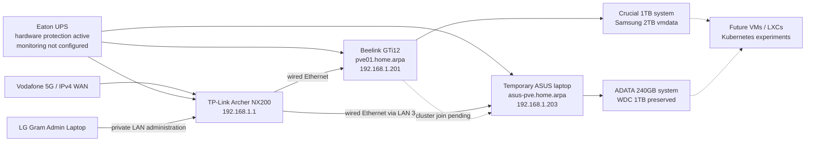

# DGS Private Cloud

Infrastructure-as-code and operations documentation for the **DGS home-lab/private-cloud platform**.

The main node is a **Beelink GTi12** running Proxmox VE 9.2. A legacy **ASUS laptop** has now been prepared as a temporary second Proxmox node for short-term clustering and migration experiments. No virtual machines or containers have been created yet.

> **Current stage:** both Proxmox hosts are installed, updated, statically addressed, time-synchronised, and mutually reachable over wired Ethernet. Peer hostname resolution and cluster formation are still pending.

## Current verified state

| Item | Main node | Temporary node |
|---|---|---|
| Role | Primary home-lab host | Temporary experimental host |
| Platform | Beelink GTi12 | ASUS legacy laptop |
| Node name | `pve01` | `asus-pve` |
| FQDN | `pve01.home.arpa` | `asus-pve.home.arpa` |
| Management URL | `https://192.168.1.201:8006` | `https://192.168.1.203:8006` |
| Management address | `192.168.1.201/24` | `192.168.1.203/24` |
| Gateway / DNS | `192.168.1.1` | `192.168.1.1` |
| PVE Manager | `9.2.4` | `9.2.4` |
| Repository policy | `pve-no-subscription` | `pve-no-subscription` |
| System disk | Crucial `CT1000P3PSSD8` 1TB | ADATA 240GB SSD |
| Additional storage | Samsung SSD 990 PRO 2TB as `vmdata` | WDC 1TB HDD preserved; not configured for Proxmox |
| Guests | None | None |
| Cluster state | Standalone | Standalone; join pending |
| Last verified | 2026-07-18 | 2026-07-18 |

## Architecture



## Repository map

```text
dgs-private-cloud/
├── README.md
├── LICENSE.md
├── AGENTS.md
├── CHANGELOG.md
├── ROADMAP.md
├── SECURITY.md
├── .gitignore
├── docs/
│   ├── 00-project-overview.md
│   ├── 01-current-state.md
│   ├── 02-hardware-and-bios.md
│   ├── 03-proxmox-installation.md
│   ├── 04-networking.md
│   ├── 05-router-ipv4-recovery.md
│   ├── 06-repositories-and-updates.md
│   ├── 07-storage-configuration.md
│   ├── 08-validation.md
│   ├── 09-operations.md
│   ├── 10-next-steps.md
│   ├── 11-temporary-asus-node.md
│   ├── diagrams/
│   ├── decisions/
│   │   └── ADR-004-temporary-two-node-cluster.md
│   └── runbooks/
│       └── remove-temporary-asus-node.md
├── inventory/
│   ├── host.yaml
│   ├── network.yaml
│   ├── power.yaml
│   └── storage.yaml
├── scripts/
├── evidence/
└── .github/
```

## Completed work

- Confirmed BIOS virtualisation settings on `pve01`.
- Installed Proxmox VE on the Beelink Crucial 1TB SSD.
- Preserved and prepared the Samsung 990 PRO 2TB SSD as `vmdata`.
- Configured static management networking for `pve01` at `192.168.1.201/24`.
- Corrected the Archer NX200 IPv4 WAN problem with a dedicated Vodafone IPv4 profile.
- Enabled the Proxmox no-subscription repository and disabled enterprise repositories.
- Updated `pve01` and confirmed PVE Manager `9.2.4`.
- Created and validated `vg_vmdata`, `thin_vmdata`, and Proxmox storage ID `vmdata`.
- Installed Proxmox VE on the ASUS ADATA 240GB SSD without using the WDC 1TB HDD.
- Configured the temporary node as `asus-pve.home.arpa` at `192.168.1.203/24`.
- Configured the ASUS no-subscription repository policy and updated it to PVE Manager `9.2.4`.
- Verified bidirectional wired connectivity between `pve01` and `asus-pve` with zero packet loss.
- Verified NTP synchronisation and the `Australia/Melbourne` time zone on both nodes.
- Confirmed the Archer LAN 3/WAN port now operates successfully as a LAN port for the ASUS node.
- Connected the Archer router, Beelink, and ASUS laptop to the Eaton UPS.

## Pending work

- Add both node mappings to `/etc/hosts` on both systems and verify cross-node name resolution.
- Create the Proxmox cluster on `pve01` and join `asus-pve`.
- Apply laptop lid-close and sleep-prevention settings on `asus-pve`.
- Define the temporary two-node quorum operating procedure; do not enable HA or Ceph.
- Configure UPS monitoring and automated graceful shutdown; hardware protection alone is currently active.
- Create the first VM or LXC.
- Configure external backups and test a restore.
- Deploy Kubernetes nodes.
- Document private remote administration.

## Documentation index

1. [Project overview](docs/00-project-overview.md)
2. [Current state](docs/01-current-state.md)
3. [Hardware and BIOS](docs/02-hardware-and-bios.md)
4. [Proxmox installation](docs/03-proxmox-installation.md)
5. [Management networking](docs/04-networking.md)
6. [Archer NX200 IPv4 recovery](docs/05-router-ipv4-recovery.md)
7. [Repositories and updates](docs/06-repositories-and-updates.md)
8. [Samsung storage configuration](docs/07-storage-configuration.md)
9. [Validation evidence](docs/08-validation.md)
10. [Operations](docs/09-operations.md)
11. [Next steps](docs/10-next-steps.md)
12. [Temporary ASUS Proxmox node](docs/11-temporary-asus-node.md)
13. [Temporary node removal runbook](docs/runbooks/remove-temporary-asus-node.md)

## Routine commands

```bash
pveversion -v
systemctl --failed
pvesm status
ip -br address
ip route
hostname -f
getent hosts pve01
getent hosts asus-pve
timedatectl
```

After the cluster is formed:

```bash
pvecm status
pvecm nodes
```

## Security boundary

The Proxmox management interfaces are private. Do not expose these ports directly to the internet:

```text
TCP 8006  Proxmox web interface
TCP 22    SSH
TCP 3128  SPICE proxy
```

Do not commit passwords, private keys, tokens, VPN profiles, SIM identifiers, public-IP screenshots, unredacted router exports, backup archives, VM disk images, or uniquely identifying hardware details that are not operationally necessary.

## Licence

Copyright © 2026 Duminda Sumanasinghe. All rights reserved.

This repository is publicly visible for reference but remains proprietary. See [LICENSE](LICENSE.md).
