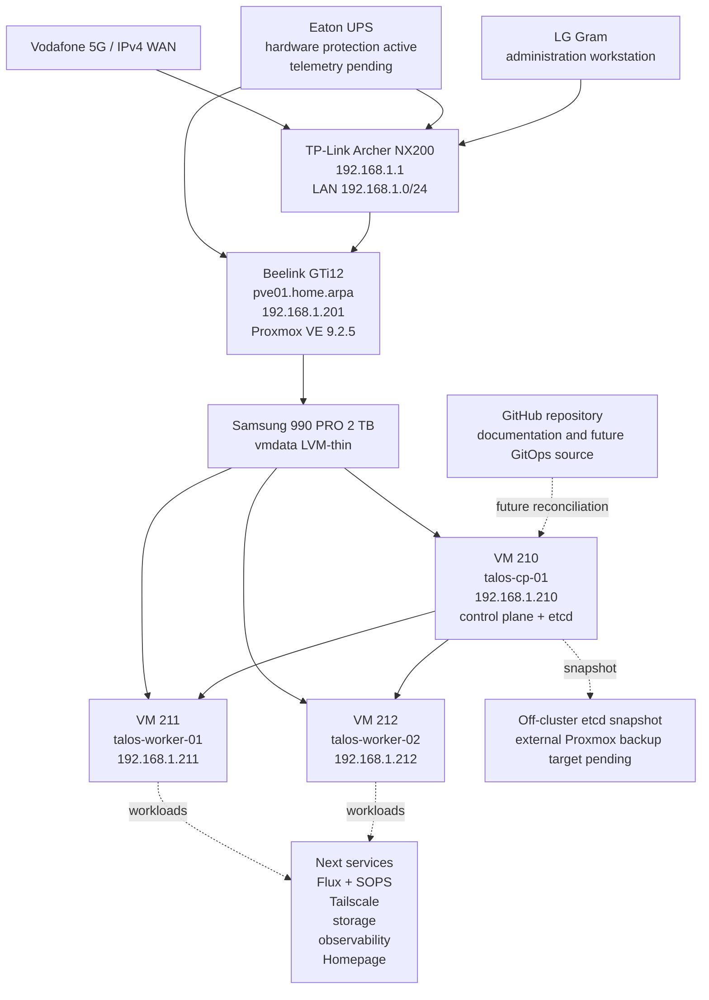

# DGS Private Cloud

Infrastructure-as-code, GitOps configuration, architecture decisions, inventories, and operations documentation for the DGS home-lab/private-cloud platform.

> **Current stage:** an operational three-node Talos Linux Kubernetes cluster is running as virtual machines on the standalone Proxmox VE host `pve01`. The cluster consists of one control-plane node and two worker nodes. All Kubernetes nodes are `Ready`, core system pods are running, a distributed Nginx workload test passed, and the first off-cluster etcd snapshot has been created.

## Current verified state

| Item | Current value |
|---|---|
| Active Proxmox node | `pve01` on Beelink GTi12 |
| Proxmox management address | `192.168.1.201/24` |
| Proxmox VE Manager | `9.2.5` observed in the web interface |
| Proxmox topology | One standalone physical host |
| Primary guest storage | Samsung 990 PRO 2 TB as `vmdata` |
| Talos version | `v1.13.6` |
| Kubernetes version | `v1.36.2` |
| Kubernetes topology | One control plane and two workers |
| Kubernetes node state | All three nodes `Ready` |
| CNI | Flannel |
| etcd | Healthy, single control-plane member |
| First etcd snapshot | Completed and stored outside the repository |
| Proxmox VM backups | Pending external backup storage |
| Flux / SOPS | Repository prepared; not yet bootstrapped |
| Last verified | 2026-07-26 |

## Active Talos Kubernetes topology

| VM | VM ID | Role | Address | vCPU | RAM | System disk |
|---|---:|---|---|---:|---:|---:|
| `talos-cp-01` | 210 | Control plane | `192.168.1.210` | 4 | 8 GiB | 64 GiB |
| `talos-worker-01` | 211 | Worker | `192.168.1.211` | 4 | 8 GiB | 64 GiB |
| `talos-worker-02` | 212 | Worker | `192.168.1.212` | 4 | 8 GiB | 64 GiB |

All VM disks are on `vmdata`, all network interfaces use VirtIO on `vmbr0`, and all three VMs boot from `scsi0`. The Talos ISO has been detached from each virtual CD/DVD drive.

## Architecture



## Completed milestones

- Installed and validated Proxmox VE on `pve01`.
- Configured the management bridge at `192.168.1.201/24`.
- Prepared the Samsung 990 PRO as `vmdata` LVM-thin storage.
- Corrected the Archer NX200 IPv4 WAN configuration.
- Completed and retired the temporary ASUS Proxmox experiment without forming a cluster.
- Created and retired disposable Ubuntu validation VM `100`.
- Installed and verified workstation tooling including `kubectl` and `talosctl`.
- Generated and uploaded a Talos `v1.13.6` installation ISO.
- Created VM `210` and cloned worker VMs `211` and `212`.
- Reserved `192.168.1.210`, `.211`, and `.212` on the LAN.
- Validated Talos maintenance-mode connectivity and `/dev/sda` on every node.
- Generated and validated node-specific Talos configurations without committing secrets.
- Applied the control-plane and worker configurations.
- Bootstrapped the first control-plane node exactly once.
- Retrieved kubeconfig and confirmed all three Kubernetes nodes are `Ready`.
- Confirmed CoreDNS, Flannel, kube-proxy, API server, controller manager, and scheduler are running.
- Ran four Nginx replicas distributed evenly across the two workers, then removed the test deployment.
- Detached the Talos ISO from all three VMs.
- Created and SHA-256-verified the first off-cluster etcd snapshot.

## Quick validation

```powershell
$CP = "192.168.1.210"
$W1 = "192.168.1.211"
$W2 = "192.168.1.212"

$env:TALOSCONFIG = (Resolve-Path ".\talos\generated\talosconfig").Path
$env:KUBECONFIG = (Resolve-Path ".\talos\generated\kubeconfig").Path

talosctl health `
  --control-plane-nodes $CP `
  --worker-nodes "$W1,$W2" `
  --endpoints $CP

kubectl get nodes -o wide
kubectl get pods -A -o wide
```

## Backup state

The first etcd snapshot was written outside the repository under the administrator workstation backup directory and verified with SHA-256. Generated Talos machine configurations, `talosconfig`, kubeconfig, etcd snapshots, VM backup archives, and private keys must never be committed.

An external backup disk, NAS, or Proxmox Backup Server is still required for durable Proxmox VM backups and restore testing.

## Immediate next work

1. Obtain and configure an external Proxmox backup destination.
2. Create full backups of VMs `210`, `211`, and `212`.
3. Test one complete VM restore and document the result.
4. Automate etcd snapshots and define retention.
5. Verify whether the installed Talos nodes retained the QEMU guest-agent extension.
6. Bootstrap Flux.
7. Configure SOPS with age and keep only encrypted secrets in Git.
8. Deploy authenticated private access with Tailscale.
9. Select and deploy the initial persistent-storage solution.
10. Deploy monitoring, logging, and Homepage.

## Repository map

```text
dgs-private-cloud/
├── README.md
├── LICENSE.md
├── AGENTS.md
├── CHANGELOG.md
├── ROADMAP.md
├── SECURITY.md
├── .gitignore
├── clusters/
│   └── home/
├── talos/
│   ├── README.md
│   ├── image-factory-schematic.yaml
│   ├── generated/              # ignored except .gitkeep
│   └── patches/
├── kubernetes/
│   ├── infrastructure/
│   └── apps/
├── docs/
│   ├── 00-project-overview.md
│   ├── 01-current-state.md
│   ├── 02-hardware-and-bios.md
│   ├── 03-proxmox-installation.md
│   ├── 04-networking.md
│   ├── 05-router-ipv4-recovery.md
│   ├── 06-repositories-and-updates.md
│   ├── 07-storage-configuration.md
│   ├── 08-validation.md
│   ├── 09-operations.md
│   ├── 10-next-steps.md
│   ├── 11-temporary-asus-node.md
│   ├── 12-first-ubuntu-vm.md
│   ├── 13-talos-kubernetes-phase1.md
│   ├── 14-talos-kubernetes-cluster-bootstrap.md
│   ├── decisions/
│   └── runbooks/
│       ├── talos-phase1-workers-and-bootstrap.md
│       └── talos-etcd-snapshot.md
├── inventory/
│   ├── host.yaml
│   ├── network.yaml
│   ├── storage.yaml
│   ├── power.yaml
│   ├── guests.yaml
│   └── kubernetes.yaml
├── scripts/
│   └── workstation/
│       └── New-TalosEtcdSnapshot.ps1
├── evidence/
└── .github/
```

## Documentation index

1. [Project overview](docs/00-project-overview.md)
2. [Current state](docs/01-current-state.md)
3. [Hardware and BIOS](docs/02-hardware-and-bios.md)
4. [Proxmox installation](docs/03-proxmox-installation.md)
5. [Management networking](docs/04-networking.md)
6. [Archer NX200 IPv4 recovery](docs/05-router-ipv4-recovery.md)
7. [Repositories and updates](docs/06-repositories-and-updates.md)
8. [Samsung storage configuration](docs/07-storage-configuration.md)
9. [Validation evidence](docs/08-validation.md)
10. [Operations](docs/09-operations.md)
11. [Next steps](docs/10-next-steps.md)
12. [Retired ASUS experiment](docs/11-temporary-asus-node.md)
13. [First Ubuntu VM lifecycle](docs/12-first-ubuntu-vm.md)
14. [Talos Phase 1 prerequisites](docs/13-talos-kubernetes-phase1.md)
15. [Talos Kubernetes cluster bootstrap](docs/14-talos-kubernetes-cluster-bootstrap.md)
16. [Talos workers and bootstrap runbook](docs/runbooks/talos-phase1-workers-and-bootstrap.md)
17. [Talos etcd snapshot runbook](docs/runbooks/talos-etcd-snapshot.md)

## Security boundary

Proxmox management, the Talos API, and the Kubernetes API remain private. Do not expose TCP `8006`, TCP `50000`, TCP `6443`, SSH, monitoring endpoints, or dashboards directly to the public internet.

Never commit:

- Talos-generated machine configurations,
- `talosconfig` or kubeconfig,
- etcd snapshots,
- age private keys,
- decrypted SOPS files,
- OAuth clients or Tailscale credentials,
- passwords, tokens, private keys, or VPN profiles,
- VM backup archives, virtual disks, ISO images, or router exports.

## Licence

Copyright © 2026 Duminda Sumanasinghe. All rights reserved.

This is proprietary project documentation. See [LICENSE](LICENSE.md).
