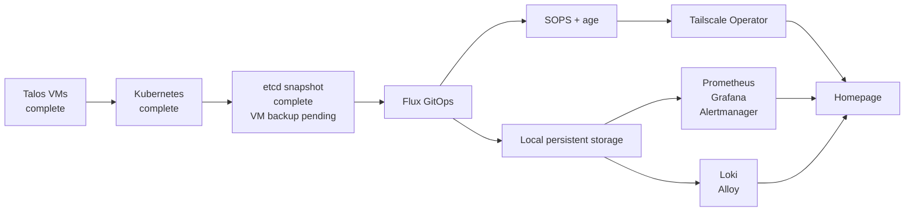

# Project Overview

## Purpose

The DGS private-cloud project is a staged home-lab platform for production-like experience with:

- Proxmox VE,
- Talos Linux and Kubernetes,
- GitOps with Flux,
- SOPS-encrypted secrets,
- authenticated private access,
- monitoring, logging, and dashboards,
- PostgreSQL and TimescaleDB,
- IoT sensor collection and automation,
- backups and disaster recovery,
- future multi-node expansion.

## Active scope

The active implementation uses one physical Proxmox host:

```text
Node: pve01
Platform: Beelink GTi12
CPU: Intel Core i9-12900H
RAM: 64 GiB
Hypervisor: Proxmox VE 9.2.5
Primary VM storage: vmdata on Samsung 990 PRO 2 TB
```

The old ASUS laptop and disposable Ubuntu validation VM are no longer part of the active architecture.

## Current implementation milestone

The first Talos Kubernetes cluster is operational:

```text
Cluster: dgs-homelab
Talos: v1.13.6
Kubernetes: v1.36.2
Control plane: talos-cp-01 / VM 210 / 192.168.1.210
Worker 1: talos-worker-01 / VM 211 / 192.168.1.211
Worker 2: talos-worker-02 / VM 212 / 192.168.1.212
Node state: all Ready
Health check: passed
First etcd snapshot: completed off-cluster
```

Phase 1 remains a single-host, single-control-plane design. It is appropriate for learning, development, and controlled home-lab workloads, but it is not physically highly available.

## Design principles

1. Keep the hypervisor and cluster management planes private.
2. Separate the Proxmox system disk from primary guest storage.
3. Treat the Git repository as the declarative source of truth after Flux bootstrap.
4. Never commit unencrypted secrets, Talos-generated credentials, or etcd snapshots.
5. Record every important change and validation result.
6. Validate each layer before deploying the next.
7. Prefer repeatable commands and runbooks.
8. Keep verified current state separate from plans.
9. Accept that Phase 1 is not highly available because every VM uses one physical host.
10. Add permanent nodes, backup infrastructure, and network segmentation incrementally.

## Phase 1 service sequence


