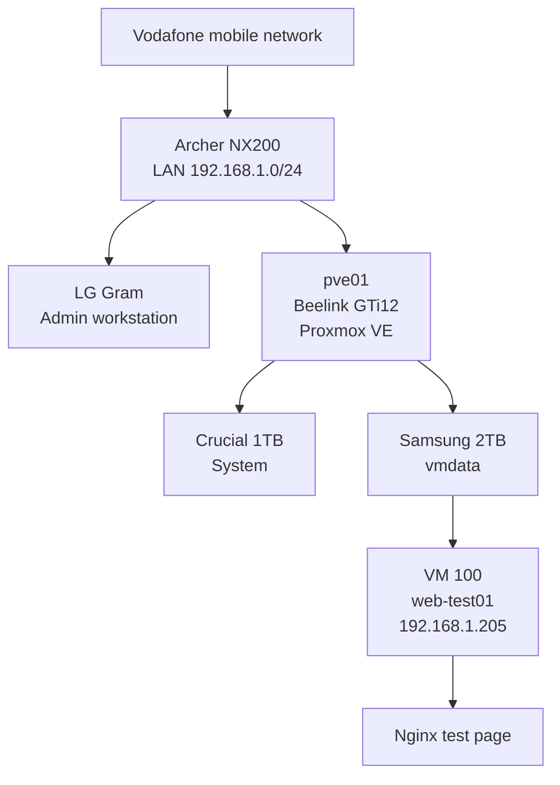

# Project Overview

## Purpose

The DGS private-cloud project is a staged home-lab platform intended to provide production-like experience with:

- Proxmox VE,
- virtual machines and LXC containers,
- multi-node clustering,
- Kubernetes staging and production-like environments,
- infrastructure automation,
- monitoring and observability,
- backups and disaster recovery,
- secure private remote administration.

## Current scope

The active platform currently consists of one standalone Proxmox host and one validated Ubuntu test VM:

```text
Node: pve01
Platform: Beelink GTi12
CPU: Intel Core i9-12900H
RAM: 64GB
Hypervisor: Proxmox VE 9.2
PVE Manager: 9.2.4
Management IP: 192.168.1.201
Primary guest storage: vmdata

VM ID: 100
VM name: ubuntu-web-test
Guest hostname: web-test01
OS: Ubuntu Server 26.04 LTS
Reserved IP: 192.168.1.205
Workload: Nginx test web server
```

The previous ASUS Proxmox evaluation is historical. It ended without cluster formation, and the laptop now runs Zorin OS.

## Design principles

1. Keep the hypervisor management plane private.
2. Separate the Proxmox system disk from primary guest storage.
3. Record every important change.
4. Validate infrastructure before building higher layers.
5. Prefer repeatable commands and runbooks.
6. Keep current-state documentation separate from future plans.
7. Avoid RAID designs that do not provide useful redundancy.
8. Use external backups rather than treating internal disks as backups.
9. Prefer router-managed DHCP reservations for small-lab guest addresses unless guest-side static configuration is specifically required.
10. Keep historical experiments documented without presenting them as active infrastructure.

## Current architecture

