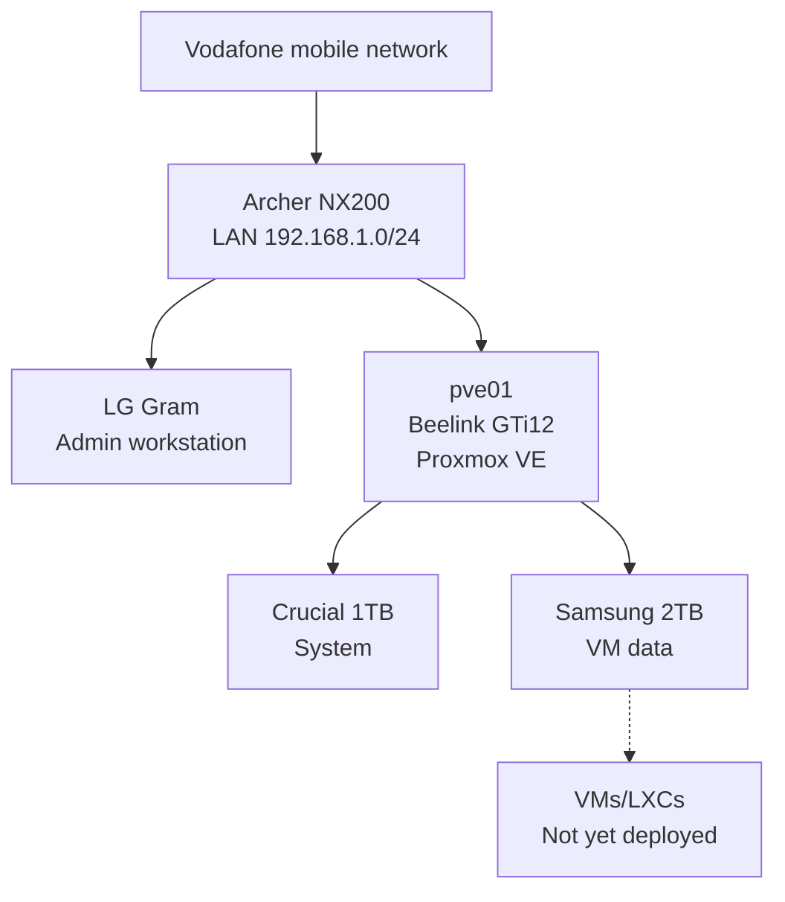

# Project Overview

## Purpose

The DGS private-cloud project is a staged home-lab platform intended to provide production-like experience with:

- Proxmox VE,
- virtual machines and LXC containers,
- multi-node clustering,
- Kubernetes staging and production-like environments,
- infrastructure automation,
- monitoring and observability,
- backups and disaster recovery,
- secure private remote administration.

## Current scope

Only the first node is complete:

```text
Node:       pve01
Platform:   Beelink GTi12
CPU:        Intel Core i9-12900H
RAM:        64GB
Hypervisor: Proxmox VE 9.2
Guests:     None
```

## Design principles

1. Keep the hypervisor management plane private.
2. Separate the Proxmox system disk from primary guest storage.
3. Record every important change.
4. Validate infrastructure before building higher layers.
5. Prefer repeatable commands and runbooks.
6. Keep current-state documentation separate from future plans.
7. Avoid RAID designs that do not provide useful redundancy.
8. Use external backups rather than treating internal disks as backups.

## Current architecture


