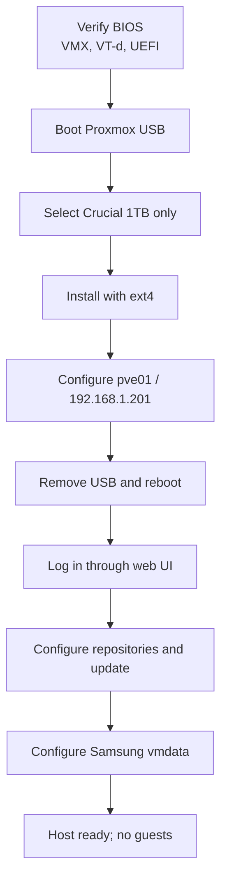

# Proxmox Installation

## Installation target

Proxmox VE was installed only on:

```text
/dev/nvme1n1
Crucial CT1000P3PSSD8
1TB
```

The Samsung SSD was not selected by the installer.

## Installer choices

| Installer item | Value |
|---|---|
| Installer mode | Graphical |
| Filesystem | ext4 |
| Country | Australia |
| Time zone | Australia/Melbourne |
| Keyboard | English US |
| Hostname entered | `pve01.home.arpa` |
| Management address | `192.168.1.201/24` |
| Gateway | `192.168.1.1` |
| DNS | `192.168.1.1` |
| Management interface | `nic0` |

## Installation sequence



## First access

```text
URL:      https://192.168.1.201:8006
Username: root
Realm:    Linux PAM standard authentication
```

The browser certificate warning is expected because the initial Proxmox certificate is self-signed.
