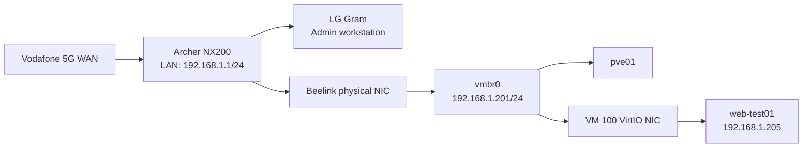

# Management and Guest Networking

## Proxmox host configuration

```text
auto lo
iface lo inet loopback

iface nic0 inet manual

auto vmbr0
iface vmbr0 inet static
        address 192.168.1.201/24
        gateway 192.168.1.1
        bridge-ports nic0
        bridge-stp off
        bridge-fd 0

iface nic1 inet manual
iface nic2 inet manual

source /etc/network/interfaces.d/*
```

## Topology



## Address reservations

The Archer NX200 provides stable LAN addressing through DHCP reservations:

| Device | Address | Reservation |
|---|---|---|
| `pve01` | `192.168.1.201` | Host management reservation |
| `web-test01` | `192.168.1.205` | VM reservation using its virtual NIC |

The exact MAC addresses are intentionally not published in the repository. They are visible in the router and Proxmox configuration when maintenance is required.

Ubuntu remains configured for DHCP. The router consistently assigns `192.168.1.205` to the VM, avoiding a duplicate static configuration inside the guest.

## Why the router shows two wired clients

`pve01` and `web-test01` share one physical Ethernet cable, but Proxmox `vmbr0` is a Layer-2 bridge. The VM has its own virtual MAC address and therefore appears to the router as a separate LAN client.

## Tailscale remote-management routing

`pve01` provides the authenticated private route from trusted Tailscale clients to the Melbourne LAN.

```text
Tailscale client -> mel-pve01 -> 192.168.1.0/24
                                    |
                                    +-> Talos API 192.168.1.210-212:50000
```

Persistent forwarding on `pve01` is configured in `/etc/sysctl.d/99-tailscale.conf`:

```text
net.ipv4.ip_forward = 1
net.ipv6.conf.all.forwarding = 1
```

The route is advertised with:

```bash
tailscale set --advertise-routes=192.168.1.0/24
```

and approved in the Tailscale administration console.

`pve01` is not an exit node. Exact Tailscale addresses and private DNS suffixes are intentionally omitted from Git.

## Verification commands

On `pve01`:

```bash
ip -br address
ip route
cat /etc/network/interfaces
ping -c 4 192.168.1.1
```

Inside `web-test01`:

```bash
hostname -I
ip -br address
ip route
ping -c 4 192.168.1.1
curl -I http://localhost
```

From Windows PowerShell:

```powershell
ping 192.168.1.205
ssh duminda@192.168.1.205
curl http://192.168.1.205
```

## Expected routing

Host:

```text
default via 192.168.1.1 dev vmbr0
192.168.1.0/24 dev vmbr0 proto kernel scope link src 192.168.1.201
```

Guest:

```text
default via 192.168.1.1
192.168.1.0/24 directly connected through the VirtIO interface
```