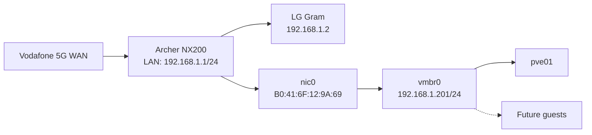

# Management Networking

## Final configuration

```text
auto lo
iface lo inet loopback

iface nic0 inet manual

auto vmbr0
iface vmbr0 inet static
        address 192.168.1.201/24
        gateway 192.168.1.1
        bridge-ports nic0
        bridge-stp off
        bridge-fd 0

iface nic1 inet manual
iface nic2 inet manual

source /etc/network/interfaces.d/*
```

## Topology



## Address reservation

The Archer NX200 reserves:

```text
MAC: B0:41:6F:12:9A:69
IP:  192.168.1.201
```

The old DHCP lease `192.168.1.3` was stale and was removed by refreshing/rebooting the router.

## Verification commands

```bash
ip -br address
ip route
cat /etc/network/interfaces
ping -c 4 192.168.1.1
curl -4 --connect-timeout 10 -I https://deb.debian.org
```

## Expected routing

```text
default via 192.168.1.1 dev vmbr0
192.168.1.0/24 dev vmbr0 proto kernel scope link src 192.168.1.201
```
