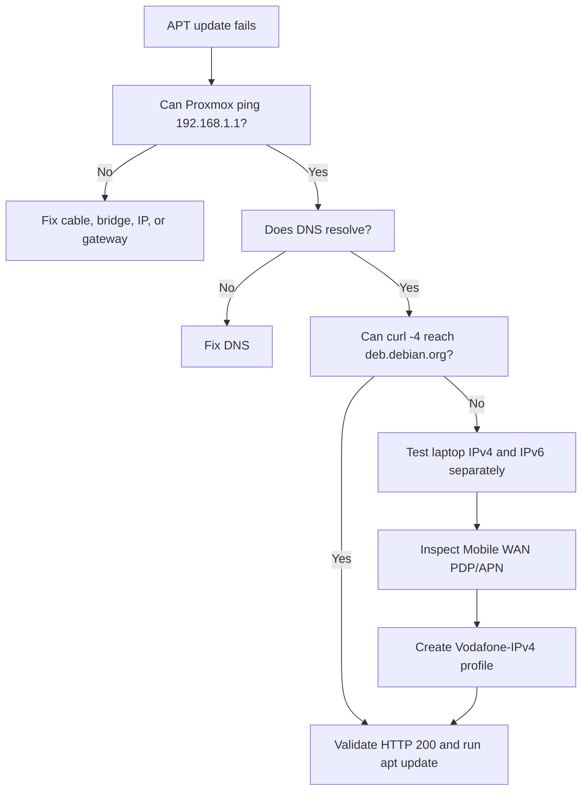

# Archer NX200 IPv4 Recovery

## Problem statement

After Proxmox was installed, local LAN access worked:

- The laptop could reach `192.168.1.201`.
- The Proxmox web interface loaded.
- Proxmox could ping `192.168.1.1`.
- DNS resolution returned addresses.

However, outbound IPv4 failed:

```text
From 192.168.1.1: Destination Net Unreachable
```

```text
curl: Failed to connect to deb.debian.org
```

The laptop appeared to have internet access because it successfully used IPv6.

## Evidence

Windows showed:

```text
RemoteAddress: IPv6 address
TcpTestSucceeded: True
```

IPv4 testing initially failed:

```text
tracert -d 1.1.1.1
192.168.1.1 reports: Destination net unreachable
```

This proved the problem was not the Proxmox bridge. The Archer NX200 did not have a usable IPv4 WAN path under the default dual-stack mobile profile.

## Resolution

A new Mobile WAN profile was created:

```text
Profile Name:        Vodafone-IPv4
PDP Type:            IPv4
APN Type:            Static
APN:                 live.vodafone.com
Username:            blank
Password:            blank
Authentication Type: NONE
```

The router then received an IPv4 WAN address and gateway.

> The actual carrier-side WAN address is intentionally omitted from this repository.

## Validation

Windows:

```powershell
Test-NetConnection 1.1.1.1 -Port 443
curl.exe --ssl-no-revoke -4 -I https://deb.debian.org
```

Successful result:

```text
TcpTestSucceeded : True
HTTP/1.1 200 OK
```

Proxmox:

```bash
curl -4 --connect-timeout 10 -I https://deb.debian.org
```

Successful result:

```text
HTTP/2 200
```

## Troubleshooting flow



## Operational note

Do not publish router screenshots that expose IMSI, ICCID, MSISDN, or other SIM identifiers.
