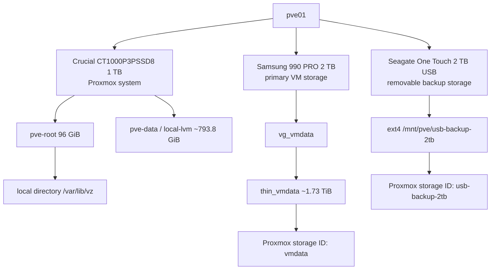

# Storage Configuration

## Storage design



## Stable disk identification

Linux device names can change. Identify disks by model, serial, capacity, and transport before destructive operations.

| Model | Nominal capacity | Role |
|---|---:|---|
| Crucial `CT1000P3PSSD8` | 1 TB | Proxmox system disk |
| Samsung `SSD 990 PRO 2TB` | 2 TB | Primary guest storage |
| Seagate `One Touch` | 2 TB | Removable VM-backup target |

## Primary VM storage

The Samsung disk contains:

```text
Volume group: vg_vmdata
Thin pool:    thin_vmdata
Storage ID:   vmdata
Purpose:      VM disks and LXC root filesystems
```

The thin pool is monitored and has enlarged metadata compared with the initial default.

## External Seagate backup storage

### Preparation completed

The factory exFAT partition was removed through the Proxmox disk interface. A GPT partition and ext4 filesystem were created, then registered as directory storage.

```text
Partition:       /dev/sda1 when observed on 2026-08-01
Filesystem:      ext4
Mount point:     /mnt/pve/usb-backup-2tb
Proxmox ID:      usb-backup-2tb
Content:         backup
Shared:          no
Node restriction: pve01
Mountpoint guard: is_mountpoint 1
Usable capacity: approximately 1.7 TiB
```

The observed `/dev/sda` name is not a permanent identity; confirm the Seagate model every time before wiping, formatting, or mounting manually.

### Verification commands

```bash
lsblk -o NAME,SIZE,FSTYPE,LABEL,MOUNTPOINTS,MODEL,TRAN
df -hT /mnt/pve/usb-backup-2tb
pvesm status
grep -A 8 '^dir: usb-backup-2tb$' /etc/pve/storage.cfg
```

Expected storage stanza:

```text
dir: usb-backup-2tb
        path /mnt/pve/usb-backup-2tb
        content backup
        is_mountpoint 1
        nodes pve01
```

### Backup retention

```text
Keep Last:    3
Keep Weekly:  2
Keep Monthly: 1
```

Retention pruning can only occur while the drive is connected, mounted, enabled, and a backup or prune operation runs.

### Baseline backup contents

```text
vzdump-qemu-210-2026_08_01-10_29_43.vma.zst
vzdump-qemu-211-2026_08_01-10_31_58.vma.zst
vzdump-qemu-212-2026_08_01-10_33_27.vma.zst
```

### Normal disconnected state

When not in use:

- `usb-backup-2tb` is disabled in Proxmox,
- `/mnt/pve/usb-backup-2tb` is not mounted,
- `pvesm status` reports the storage as disabled,
- the physical USB disk is disconnected and stored safely.

## Final storage IDs

| ID | Type | Content | Normal state |
|---|---|---|---|
| `local` | Directory | Backup, import, ISO, templates | Active |
| `local-lvm` | LVM-thin | Disk image, container | Active |
| `vmdata` | LVM-thin | Disk image, container | Active |
| `usb-backup-2tb` | Directory on ext4 USB HDD | Backup | Disabled when disconnected |
