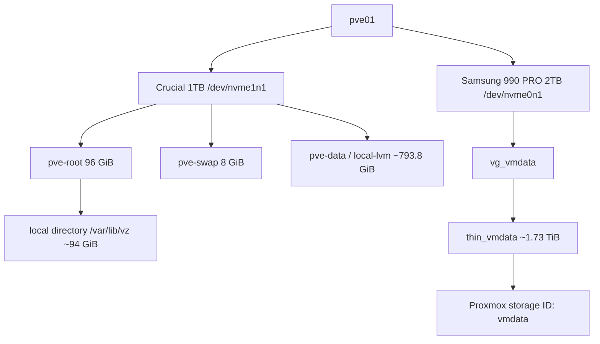

# Storage Configuration

## Storage design



## Physical disks

```text
/dev/nvme1n1
Model: CT1000P3PSSD8
Role: Proxmox system disk
```

```text
/dev/nvme0n1
Model: Samsung SSD 990 PRO 2TB
Role: Primary guest storage
```

## Samsung volume group

Created through the Proxmox GUI:

```text
Volume group: vg_vmdata
Physical disk: /dev/nvme0n1
```

Verification:

```bash
vgs
```

Initial state:

```text
vg_vmdata  1 PV  0 LV  <1.82 TiB free
```

## Thin pool creation

Because the disk was already assigned to a volume group, the GUI's whole-disk thin-pool wizard showed `No Disks unused`.

The thin pool was created inside the existing VG:

```bash
lvcreate --type thin-pool -l 95%FREE -n thin_vmdata vg_vmdata
```

Registered in Proxmox:

```bash
pvesm add lvmthin vmdata \
  --vgname vg_vmdata \
  --thinpool thin_vmdata \
  --content images,rootdir
```

## Metadata improvement

Initial metadata was approximately 112 MiB. It was extended:

```bash
lvextend --poolmetadatasize +1G vg_vmdata/thin_vmdata
```

Final state:

```text
thin-pool size:       approximately 1.73 TiB
metadata size:        approximately 1.11 GiB
data usage:           0.00%
metadata usage:       1.46%
monitoring:           enabled
```

Verification:

```bash
lvs -a -o lv_name,vg_name,lv_attr,lv_size,data_percent,metadata_percent
lvs -o lv_name,vg_name,seg_monitor vg_vmdata/thin_vmdata
pvesm status
```

## Final storage IDs

| ID | Type | Content |
|---|---|---|
| `local` | Directory | Backup, import, ISO image, container template |
| `local-lvm` | LVM-thin | Disk image, container |
| `vmdata` | LVM-thin | Disk image, container |
