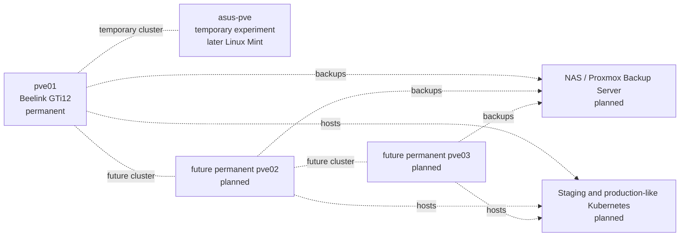

# Next Steps

## Immediate next task: complete peer hostname resolution

The current `/etc/hosts` files contain only each node's own management mapping. Add both mappings on **both** nodes.

Edit on `pve01` and `asus-pve`:

```bash
nano /etc/hosts
```

Ensure these lines are present exactly once:

```text
192.168.1.201  pve01.home.arpa     pve01
192.168.1.203  asus-pve.home.arpa  asus-pve
```

Keep the existing localhost and IPv6 entries.

Validate on both nodes:

```bash
getent hosts pve01
getent hosts pve01.home.arpa
getent hosts asus-pve
getent hosts asus-pve.home.arpa
ping -c 4 pve01
ping -c 4 asus-pve
```

Expected result:

```text
pve01 and pve01.home.arpa         -> 192.168.1.201
asus-pve and asus-pve.home.arpa   -> 192.168.1.203
```

Do not create the cluster until all six validation commands succeed on both nodes.

## Create the temporary cluster

On `pve01`:

1. Open **Datacenter → Cluster**.
2. Select **Create Cluster**.
3. Use a cluster name such as `homelab`.
4. Select `192.168.1.201` for Link 0.
5. Verify:

```bash
pvecm status
pvecm nodes
```

At this point only `pve01` should be listed and it should be quorate.

## Join the ASUS node

Confirm `asus-pve` has no VMs or containers. Then:

1. On `pve01`, open **Datacenter → Cluster → Join Information**.
2. Copy the join information.
3. On `asus-pve`, open **Datacenter → Cluster → Join Cluster**.
4. Paste the join information.
5. Enter the `pve01` root password.
6. Select `192.168.1.203` for the ASUS cluster link.
7. Wait for the ASUS interface to reconnect.

Verify from either node:

```bash
pvecm status
pvecm nodes
```

Expected important values:

```text
Nodes:          2
Expected votes: 2
Total votes:    2
Quorate:        Yes
```

## Post-join configuration

- Disable sleep, hibernation, and lid-triggered suspend on the ASUS laptop.
- Do not enable HA or Ceph.
- Keep both nodes online during cluster administration.
- Use disposable test workloads on `asus-pve`.
- Document every migration or failure test.

## First guest validation

After the cluster is healthy, create a small Ubuntu test VM:

```text
Name:     ubuntu-test
vCPU:     2
RAM:      4GB
Disk:     32GB
Storage:  vmdata or disposable ASUS local-lvm
Bridge:   vmbr0
```

Validate:

- VM creation,
- console access,
- DHCP or static addressing,
- DNS,
- outbound internet,
- clean shutdown and restart,
- guest agent,
- snapshot and rollback,
- manual migration behaviour.

## End of temporary experiment

Before reinstalling Linux Mint, follow [the temporary-node removal runbook](runbooks/remove-temporary-asus-node.md). Never erase the ASUS Proxmox installation while `asus-pve` is still registered as a cluster member.

## Long-term target


