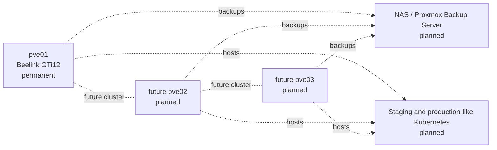

# Next Steps

## Immediate next task: snapshot and rollback validation

VM `100` is the first validated guest. The next controlled exercise should test a snapshot before adding more infrastructure.

Suggested sequence:

1. Start VM `100`.
2. Confirm the website and guest agent are healthy.
3. Create a snapshot named `before-change`.
4. Modify the test page.
5. Confirm the change in the browser.
6. Shut down the VM if required by the selected snapshot mode.
7. Roll back to `before-change`.
8. Confirm the original page and services return.
9. Record storage use before and after the test.

Do not use snapshots as a replacement for backups.

## Backup and restore

After snapshot validation:

- select an external backup destination,
- create a scheduled Proxmox backup job,
- produce a backup of VM `100`,
- verify backup integrity,
- restore to a different test VM ID,
- start the restored VM on an isolated or carefully controlled network,
- confirm that Nginx and the guest agent work.

## Reusable Ubuntu template

Choose one of these approaches:

- retain VM `100` as a manual learning VM,
- clone VM `100` and sanitise it before conversion to a template,
- build a new cloud-init Ubuntu template.

A template should not contain reused SSH host keys, temporary passwords, shell history, or application-specific test data.

## UPS integration

- Record the exact Eaton model and USB/network capabilities.
- Connect UPS telemetry to an appropriate system.
- Configure alerts.
- Define the guest-shutdown order.
- Configure a delayed graceful shutdown for `pve01`.
- Test without risking filesystem corruption.

## Security hardening

- Create a named Proxmox administrator account.
- Enable two-factor authentication.
- Configure SSH keys.
- Review root password-based SSH.
- Define Proxmox firewall policy.
- Keep TCP 8006 private.
- Document Tailscale or WireGuard remote administration.

## Permanent multi-node planning

The ASUS laptop is no longer a Proxmox candidate. Future clustering work requires permanent hardware.

Planned decisions:

- select permanent `pve02` and `pve03`,
- standardise CPU, RAM, storage, and NIC capabilities,
- allocate stable management addresses,
- define an odd-vote quorum strategy,
- choose backup and shared-storage architecture,
- test migration only after backups exist.

## Long-term target

