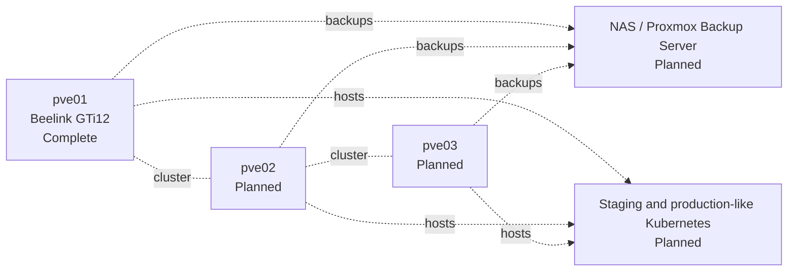

# Next Steps

## Immediate next task

Create a small Ubuntu test VM on `vmdata`.

Suggested first VM:

```text
Name:       ubuntu-test
vCPU:       2
RAM:        4GB
Disk:       32GB
Storage:    vmdata
Bridge:     vmbr0
Firmware:   UEFI or BIOS according to template decision
```

Validate:

- VM creation,
- console access,
- DHCP or static addressing,
- DNS,
- outbound internet,
- clean shutdown,
- restart,
- guest agent,
- snapshot,
- rollback.

## Before production-like workloads

1. Configure external backups.
2. Test a full VM restore.
3. Add UPS protection.
4. Enable named-user administration and 2FA.
5. Define firewall policy.
6. Document private remote access.
7. Create an Ubuntu VM template.
8. Record VM naming, ID, addressing, CPU, RAM, and disk conventions.

## Multi-node target


