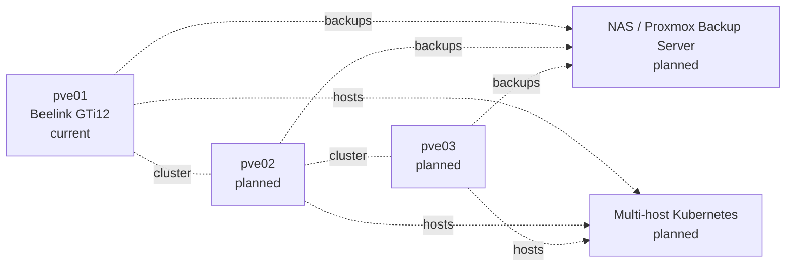

# Next Steps

## Immediate priority — durable backup and recovery

1. Purchase or allocate an external backup target.
2. Add it to Proxmox as storage that accepts `VZDump backup file` content, or deploy Proxmox Backup Server later.
3. Back up VMs `210`, `211`, and `212`.
4. Verify backup archive integrity and available capacity.
5. Restore one VM into an isolated test ID and validate that it boots.
6. Schedule regular etcd snapshots and copy them off the LG Gram.
7. Define retention for etcd snapshots and Proxmox backups.
8. Document a controlled disaster-recovery test.

## Platform verification before adding services

- Verify the installed Talos system-extension list and whether the QEMU guest agent is running.
- Record a current `qm config` export for each VM with MAC addresses redacted.
- Record cluster certificate and kubeconfig expiry considerations.
- Decide whether control-plane workload scheduling should remain enabled.
- Define resource headroom for platform services and application workloads.

## GitOps and secrets

1. Bootstrap Flux against `clusters/home/`.
2. Create an age key outside the repository.
3. Configure SOPS.
4. Commit only encrypted Kubernetes secret manifests.
5. Add validation in CI to detect plaintext secrets and invalid YAML.

## Private remote access

1. Deploy the Tailscale Kubernetes Operator or another reviewed private-access method.
2. Keep Proxmox, Talos API, Kubernetes API, Grafana, Prometheus, Loki, and databases off the public internet.
3. Define named-user administration and MFA.

## Persistent storage

Choose the initial storage path before deploying stateful applications:

- simple local-path storage for disposable and low-risk workloads,
- a more resilient CSI solution when additional physical nodes or NAS storage become available.

Do not deploy PostgreSQL or TimescaleDB until backup, restore, and persistent-volume behaviour are understood.

## Observability and dashboard

Deploy in controlled stages:

1. metrics-server,
2. Prometheus,
3. Grafana,
4. Alertmanager,
5. Loki,
6. Grafana Alloy,
7. Homepage.

Set resource requests and limits and verify the cluster remains within the Beelink resource budget.

## IoT platform

After storage and observability are stable:

- deploy PostgreSQL and TimescaleDB,
- deploy MQTT,
- deploy Node-RED or an equivalent automation layer,
- begin polytunnel sensor ingestion,
- add UPS telemetry,
- define application-level backup policies.

## Long-term multi-node target

