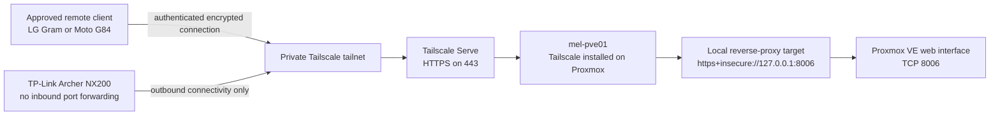

# Tailscale Reverse Proxy for Remote Proxmox Administration

## Status

**Implemented and externally verified on 2026-08-03.**

The Proxmox host `pve01` can now be administered securely from outside the
Melbourne LAN by using Tailscale on approved client devices.

Verified client paths:

- LG Gram laptop through a different Wi-Fi network;
- Moto G84 phone through the mobile network;
- direct Tailscale connectivity to Proxmox TCP port `8006`;
- private HTTPS access through Tailscale Serve.

The production URL and Tailscale-assigned IP are deliberately recorded only in
local operator notes. Public or broadly shared documentation must use the
sanitised forms shown below.

## Objective

Provide private remote access to the Proxmox web interface without:

- forwarding TCP port `8006` on the TP-Link Archer NX200;
- exposing Proxmox to the public internet;
- depending on a fixed public IPv4 address;
- using Tailscale Funnel.

## Architecture



## Addressing model

| Purpose | Sanitised form | Notes |
|---|---|---|
| Melbourne LAN address | `https://192.168.1.201:8006/` | Works on the home LAN; later reachable through a subnet router if configured |
| Direct Tailscale fallback | `https://<tailscale-ip>:8006/` | Uses the Proxmox self-signed certificate |
| Preferred remote URL | `https://mel-pve01.<tailnet-name>.ts.net/` | Uses Tailscale Serve and standard HTTPS port `443` |
| Tailscale device name | `mel-pve01` | Stable server hostname inside the tailnet |

Do not commit the actual tailnet DNS suffix, authentication URLs, device keys,
OAuth credentials, or unredacted screenshots.

## Prerequisites

- Proxmox VE is operational on `pve01`.
- Proxmox management is available locally at
  `https://192.168.1.201:8006/`.
- The LG Gram and Moto G84 are authenticated to the same Tailscale tailnet.
- MagicDNS is enabled.
- The operator account controls the Tailscale admin console.
- Tailscale Funnel remains disabled.

## 1. Install Tailscale on the Proxmox host

Run from the Proxmox root shell:

```bash
apt update
apt install -y curl

curl -fsSL https://tailscale.com/install.sh | sh

systemctl enable --now tailscaled

tailscale up --hostname=mel-pve01
```

Open the authentication URL printed by `tailscale up`, sign in to the correct
tailnet, and approve the device.

The authentication URL is short-lived and sensitive. Never place it in Git,
screenshots, tickets, or documentation.

## 2. Validate the Tailscale service

Run on Proxmox:

```bash
systemctl is-enabled tailscaled
systemctl is-active tailscaled
tailscale status
tailscale ip -4
```

Expected service state:

```text
enabled
active
```

The server should appear as `mel-pve01` in the Tailscale Machines page.

## 3. Enable private HTTPS support

In the Tailscale Serve enablement page:

1. Keep **HTTPS certificates** enabled.
2. Disable **Tailscale Funnel**.
3. Select **Enable HTTPS**.

Funnel must remain disabled because the Proxmox management plane is private.

## 4. Configure Tailscale Serve

Run on Proxmox:

```bash
tailscale serve --bg https+insecure://127.0.0.1:8006
```

The special `https+insecure` backend scheme is required because Proxmox uses a
self-signed certificate on its local HTTPS listener.

Verify the configuration:

```bash
tailscale serve status
```

Expected logical result:

```text
https://mel-pve01.<tailnet-name>.ts.net/
└── proxy https+insecure://127.0.0.1:8006
```

The `--bg` option stores the Serve configuration so it remains active after
normal Tailscale service restarts.

## 5. Validate from the LG Gram

The Windows Tailscale client must be installed, signed in, and connected.

PowerShell checks:

```powershell
tailscale version
tailscale status
tailscale ping mel-pve01
Test-NetConnection mel-pve01 -Port 8006
```

Successful TCP validation includes:

```text
TcpTestSucceeded : True
```

Browser checks:

```text
Preferred: https://mel-pve01.<tailnet-name>.ts.net/
Fallback:  https://<tailscale-ip>:8006/
```

A certificate warning on the direct IP fallback is expected. The Tailscale
Serve URL should use a valid HTTPS certificate.

## 6. Validate from the Moto G84

1. Connect the Android Tailscale client.
2. Leave **Exit node** set to `None`.
3. Disable Wi-Fi so the phone uses mobile data.
4. Open the sanitised Serve URL:
   `https://mel-pve01.<tailnet-name>.ts.net/`.
5. Sign in to Proxmox.
6. Verify the node dashboard is visible.
7. Open a safe read-only view such as Summary or Task History.

Do not perform disruptive changes during the first external connectivity test.

## 7. External-network acceptance test

Remote access is accepted only after both of these tests succeed:

- Moto G84 reaches the Serve URL over mobile data.
- LG Gram reaches the Serve URL over a Wi-Fi network different from the
  Melbourne home LAN.

This proves the configuration is not relying on local LAN routing.

## 8. Security controls

Required controls:

- Tailscale Serve enabled.
- Tailscale Funnel disabled.
- No Archer NX200 forwarding for TCP `8006`, `22`, or `6443`.
- Strong Proxmox credentials.
- Proxmox two-factor authentication enabled before extended travel.
- Key expiry reviewed for `mel-pve01`; disabling expiry is appropriate only
  because it is a trusted remote infrastructure server.
- Client devices protected by screen lock and full-disk encryption.
- Actual Tailscale addresses kept in ignored local notes.
- Unredacted screenshots stored only under `evidence/private/`.

## 9. Routine operation

On Proxmox:

```bash
systemctl status tailscaled --no-pager
tailscale status
tailscale netcheck
tailscale serve status
systemctl status pveproxy --no-pager
ss -lntp | grep 8006
```

On the LG Gram:

```powershell
tailscale status
tailscale ping mel-pve01
Test-NetConnection mel-pve01 -Port 8006
```

## 10. Recovery procedures

### Tailscale service stopped

```bash
systemctl restart tailscaled
systemctl status tailscaled --no-pager
tailscale status
```

### Serve configuration missing

```bash
tailscale serve --bg https+insecure://127.0.0.1:8006
tailscale serve status
```

### Proxmox web service unavailable

```bash
systemctl status pveproxy --no-pager
systemctl restart pveproxy
ss -lntp | grep 8006
```

### Remove Serve configuration

```bash
tailscale serve reset
```

Do not run `tailscale up --force-reauth` while Tailscale is the only available
administrative path.

## 11. Known limitations

This is secure remote network access, not out-of-band management.

It cannot recover from:

- a failed Archer NX200;
- a complete Melbourne internet outage;
- a powered-off or frozen Proxmox host;
- loss of UPS power;
- hardware failure;
- a Tailscale account lockout.

Maintain UPS protection, automatic power recovery in BIOS, fresh backups, and a
trusted local contact for physical intervention.

## 12. Next stage

Configure the Raspberry Pi 5 as a physically separate Tailscale subnet router
for controlled access to selected Melbourne LAN devices, including sensor
gateways and Talos node addresses.

The Raspberry Pi subnet-router work must be documented separately and must not
replace the direct `mel-pve01` Tailscale endpoint.
