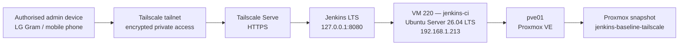

# Jenkins Controller Phase 1

## Scope

This document records the completed **Jenkins Controller Phase 1** implementation on `pve01`, completed across **2026-08-06 and 2026-08-07**.

The phase established:

- a dedicated Ubuntu Server virtual machine for Jenkins,
- Jenkins LTS with Java 21,
- QEMU Guest Agent integration with Proxmox,
- a reserved LAN address,
- private HTTPS access through Tailscale Serve,
- loopback-only Jenkins HTTP binding,
- a successful synthetic Jenkins Pipeline smoke test,
- remote-access validation over mobile data,
- and a known-good Proxmox snapshot.

Phase 2, which will introduce a separate Jenkins build agent, is intentionally deferred.

---

## Final verified state

| Item | Verified value |
|---|---|
| Proxmox host | `pve01` |
| VM ID | `220` |
| VM name / hostname | `jenkins-ci` |
| CPU | 1 socket, 4 vCPU cores, type `host` |
| Memory | 8192 MiB (8 GiB), ballooning disabled |
| Start at boot | enabled (`onboot: 1`) |
| Guest Agent option | enabled (`agent: 1`) |
| Guest OS | Ubuntu Server 26.04 LTS |
| LAN address | `192.168.1.213/24` |
| Network assignment | DHCP reservation on the Archer NX200 |
| Network interface | VirtIO on `vmbr0`; Proxmox firewall enabled |
| System disk | `scsi0`, 100 GiB virtual disk on `vmdata`; discard, IO thread and SSD emulation enabled |
| Root filesystem | approximately 96 GiB ext4 through LVM |
| QEMU Guest Agent | active |
| Java | OpenJDK `21.0.11` |
| Git | `2.53.0` |
| Jenkins | `2.568.2` |
| Jenkins service | enabled and active |
| Tailscale service | enabled and active |
| Jenkins HTTP listener | loopback only, port `8080` |
| Remote entry point | Tailscale Serve HTTPS hostname |
| Direct LAN access to `192.168.1.213:8080` | refused as designed |
| Smoke pipeline | `jenkins-learning-smoke` |
| Smoke build | Build `#1` — `SUCCESS` |
| Remote mobile-data test | successful through Tailscale |
| Proxmox snapshot | `jenkins-baseline-tailscale` |

The exact private `*.ts.net` hostname is operational information and does not need to be stored in the public repository. Use the form:

```text
https://jenkins-ci.<tailnet>.ts.net
```

---

## Architecture



The Jenkins controller is not exposed through router port forwarding and does not use Tailscale Funnel. The HTTP listener is restricted to loopback so port `8080` cannot be accessed directly from the LAN.

---

## 1. Proxmox VM creation

A dedicated QEMU VM was selected instead of an LXC container to keep Jenkins isolated and to avoid future container-build complications involving LXC nesting, cgroups, AppArmor, and Docker permissions.

### VM identity

```text
VM ID:       220
Name:        jenkins-ci
CPU:         1 socket / 4 cores / type host
Memory:      8192 MiB
Ballooning:  disabled
Start boot:  enabled
Guest agent: enabled
```

### Installation media

The existing Ubuntu Server ISO stored under Proxmox `local` ISO storage was used:

```text
ubuntu-26.04-live-server-amd64.iso
```

### VM storage

The VM was created with a 100 GiB virtual system disk on `vmdata`. Proxmox reports `discard=on`, `iothread=1`, `ssd=1`, and the `VirtIO SCSI Single` controller.

During Ubuntu guided storage configuration:

- the whole virtual disk was selected,
- LVM was enabled,
- LUKS encryption was not enabled,
- the root logical volume was expanded to consume the available LVM capacity.

Final validation:

```bash
df -h /
```

Verified root filesystem:

```text
Filesystem                         Size  Used  Avail  Mounted on
/dev/mapper/ubuntu--vg-ubuntu--lv   96G  ...   ...    /
```

### Boot configuration

After the OS installation completed, the installation CD/DVD device was removed from the effective boot sequence.

Required boot state:

```text
boot: order=scsi0;net0
scsi0   enabled and first
net0    enabled and second
ide2    defined as CD-ROM but excluded from the effective boot order
```

The virtual CD/DVD device may remain defined as hardware, but it must not take precedence over the installed system disk.

---

## 2. Ubuntu Server installation

The VM was installed with:

```text
Operating system: Ubuntu Server 26.04 LTS
Hostname:         jenkins-ci
Administrator:    local sudo-enabled account
OpenSSH server:   installed
Featured snaps:   none
```

The installer initially obtained a DHCP address. A permanent address was then assigned by DHCP reservation at the router.

Final address:

```text
192.168.1.213/24
```

Validation:

```bash
whoami
hostname
ip -br address
ip route
```

Expected hostname:

```text
jenkins-ci
```

Expected interface state includes:

```text
ens18    UP    192.168.1.213/24
```

---

## 3. Base package preparation

The guest was updated and the required administration tools were installed.

```bash
sudo apt update
sudo apt full-upgrade -y

sudo apt install -y \
  qemu-guest-agent \
  ca-certificates \
  curl \
  wget \
  gnupg \
  git \
  unzip \
  jq \
  ufw
```

The Proxmox guest agent was enabled:

```bash
sudo systemctl enable --now qemu-guest-agent
systemctl is-active qemu-guest-agent
```

Verified result:

```text
active
```

---

## 4. Java 21 installation

Jenkins was installed on OpenJDK 21.

```bash
sudo apt update
sudo apt install -y fontconfig openjdk-21-jre
```

Validation:

```bash
java -version
```

Verified runtime:

```text
openjdk version "21.0.11"
```

---

## 5. Jenkins LTS installation

The Jenkins LTS Debian repository was configured and Jenkins was installed through `apt`.

```bash
sudo install -m 0755 -d /etc/apt/keyrings

sudo wget -O /etc/apt/keyrings/jenkins-keyring.asc \
  https://pkg.jenkins.io/debian-stable/jenkins.io-2026.key

echo "deb [signed-by=/etc/apt/keyrings/jenkins-keyring.asc] https://pkg.jenkins.io/debian-stable binary/" \
  | sudo tee /etc/apt/sources.list.d/jenkins.list > /dev/null

sudo apt update
sudo apt install -y jenkins
```

The service was enabled and started:

```bash
sudo systemctl enable --now jenkins
systemctl is-enabled jenkins
systemctl is-active jenkins
```

Verified state:

```text
enabled
active
```

The installed Jenkins version observed in the web interface was:

```text
2.568.2
```

---

## 6. Initial Jenkins web setup

Initial setup was performed temporarily through the LAN endpoint:

```text
http://192.168.1.213:8080
```

The one-time setup password was read locally from:

```bash
sudo cat /var/lib/jenkins/secrets/initialAdminPassword
```

The password itself was not recorded in documentation.

During the setup wizard:

1. suggested plugins were installed,
2. a permanent Jenkins administrator account was created,
3. the temporary setup identity was replaced by the permanent account,
4. Jenkins reached the normal Dashboard and Manage Jenkins interfaces.

No Jenkins passwords, email addresses, API tokens, or other credentials are stored in this repository.

---

## 7. Tailscale installation

Tailscale was installed directly inside VM `220`.

This is separate from any Kubernetes Tailscale Operator deployment. The Jenkins VM is a standalone guest and therefore maintains its own Tailscale node identity.

Installation:

```bash
curl -fsSL https://tailscale.com/install.sh | sh
```

Join the existing tailnet:

```bash
sudo tailscale up
```

Validation:

```bash
tailscale status
tailscale ip -4
systemctl is-enabled tailscaled
systemctl is-active tailscaled
```

Verified service state:

```text
enabled
active
```

Do not commit:

- Tailscale authentication keys,
- OAuth client secrets,
- node keys,
- exported VPN profiles,
- or screenshots containing sensitive Tailscale credentials.

---

## 8. Tailscale Serve reverse proxy

Jenkins was published privately inside the tailnet through Tailscale Serve.

The resulting access pattern is:

```text
https://jenkins-ci.<tailnet>.ts.net
        |
        +-- proxy --> http://127.0.0.1:8080
```

The persistent Serve configuration was created with the background mode.

Example:

```bash
sudo tailscale serve --bg 8080
```

Validation:

```bash
sudo tailscale serve status
```

Verified pattern:

```text
https://jenkins-ci.<tailnet>.ts.net (tailnet only)
|-- / proxy http://127.0.0.1:8080
```

Tailscale Serve is private to authorised tailnet members. This implementation does **not** use Tailscale Funnel.

---

## 9. Restrict Jenkins to loopback

After private HTTPS access was proven, Jenkins was prevented from listening on all VM interfaces.

Initial listener:

```bash
sudo ss -lntp | grep ':8080'
```

Before hardening, Jenkins listened on all interfaces.

A systemd override was created:

```bash
sudo systemctl edit jenkins
```

Only the editable drop-in section was changed:

```ini
[Service]
Environment="JENKINS_LISTEN_ADDRESS=127.0.0.1"
```

Then:

```bash
sudo systemctl daemon-reload
sudo systemctl restart jenkins
sudo systemctl status jenkins --no-pager
```

Validation:

```bash
sudo ss -lntp | grep ':8080'
curl -I http://127.0.0.1:8080/login
sudo tailscale serve status
```

Verified Jenkins listener:

```text
127.0.0.1:8080
```

On the running Java process this may appear as an IPv4-mapped loopback address similar to:

```text
[::ffff:127.0.0.1]:8080
```

The important property is that it is loopback-only.

---

## 10. Access-control validation

### Local Jenkins process test

```bash
curl -I http://127.0.0.1:8080/login
```

Verified:

```text
HTTP/1.1 200 OK
```

### Direct LAN test

Browser request:

```text
http://192.168.1.213:8080
```

Verified result:

```text
connection refused
```

This is expected and desired.

### Tailnet HTTPS test

Browser request:

```text
https://jenkins-ci.<tailnet>.ts.net
```

Verified:

```text
Jenkins Dashboard accessible
```

### Mobile-data test

Remote access was tested from a phone while using mobile data rather than the Melbourne home Wi-Fi.

With Tailscale connected, the Jenkins HTTPS endpoint loaded successfully.

This verifies that remote Jenkins administration does not depend on being connected to the local `192.168.1.0/24` network.

---

## 11. Jenkins URL

After Tailscale Serve was validated, the Jenkins Location URL was changed under:

```text
Manage Jenkins
  -> System
  -> Jenkins Location
  -> Jenkins URL
```

The public-repository-safe form is:

```text
https://jenkins-ci.<tailnet>.ts.net/
```

The exact private tailnet hostname may be maintained in local operator notes if desired.

---

## 12. Synthetic smoke pipeline

A simple Pipeline job was created:

```text
jenkins-learning-smoke
```

The purpose was to prove that:

- Jenkins could schedule a Pipeline,
- shell steps executed,
- the workspace was writable,
- the Jenkins service account executed the workload,
- Java was available,
- Git was available,
- Pipeline stages and post actions worked.

Pipeline:

```groovy
pipeline {
    agent any

    stages {
        stage('System Info') {
            steps {
                sh '''
                    echo "=== Jenkins CI Test ==="
                    echo "Hostname: $(hostname)"
                    echo "User: $(whoami)"
                    echo "Build: ${BUILD_NUMBER}"
                    echo "Workspace: ${WORKSPACE}"
                '''
            }
        }

        stage('Tool Check') {
            steps {
                sh '''
                    java -version
                    git --version
                '''
            }
        }

        stage('Test') {
            steps {
                sh '''
                    echo "Running simple test..."
                    test 10 -gt 5
                    echo "Test passed."
                '''
            }
        }
    }

    post {
        success {
            echo 'JENKINS PIPELINE SUCCESSFUL'
        }

        failure {
            echo 'JENKINS PIPELINE FAILED'
        }
    }
}
```

Observed execution details:

```text
Hostname: jenkins-ci
User: jenkins
Build: 1
Workspace: /var/lib/jenkins/workspace/jenkins-learning-smoke
Java: OpenJDK 21.0.11
Git: 2.53.0
```

Final result:

```text
JENKINS PIPELINE SUCCESSFUL
Finished: SUCCESS
```

Build `#1` therefore establishes the first known-good Jenkins Pipeline execution baseline.

---

## 13. Built-in-node warning

The smoke test intentionally ran on the Jenkins built-in node.

Jenkins correctly warns that executing normal builds on the controller can be a security risk.

This is accepted only for the Phase 1 smoke test.

The planned Phase 2 design is:

```text
VM 220  jenkins-ci       -> controller/orchestrator
VM 221  jenkins-agent01  -> dedicated build executor
```

After the agent is operational, the built-in controller executor count should be set to `0`.

---

## 14. Proxmox snapshot

After Jenkins, Tailscale Serve, loopback binding, and the smoke pipeline were validated, a Proxmox snapshot was created.

```text
Snapshot name:
jenkins-baseline-tailscale

RAM included:
No
```

Description:

```text
Ubuntu 26.04 + Java 21 + Jenkins LTS + Tailscale Serve private HTTPS access configured.
```

The snapshot provides a convenient rollback point before Phase 2 experiments.

A Proxmox snapshot is **not** a replacement for an external VM backup. VM `220` should be included in a future VZDump backup generation on external storage.

---

## 15. Routine validation commands

### Guest identity and filesystem

```bash
hostname
ip -br address
df -h /
```

### Jenkins

```bash
systemctl is-enabled jenkins
systemctl is-active jenkins
sudo systemctl status jenkins --no-pager
sudo ss -lntp | grep ':8080'
curl -I http://127.0.0.1:8080/login
```

### Tailscale

```bash
systemctl is-enabled tailscaled
systemctl is-active tailscaled
tailscale status
sudo tailscale serve status
```

### QEMU Guest Agent

```bash
systemctl is-active qemu-guest-agent
```

Expected high-level state:

```text
jenkins             enabled / active
tailscaled          enabled / active
qemu-guest-agent    active
Jenkins :8080       loopback only
Tailscale Serve     HTTPS -> 127.0.0.1:8080
```

---

## 16. Security boundary

The following controls are part of the completed Phase 1 baseline:

- no router port-forward for Jenkins TCP `8080`,
- no Tailscale Funnel,
- Jenkins HTTP bound to loopback only,
- remote browser access through authenticated Tailscale membership,
- HTTPS provided by Tailscale Serve,
- Jenkins administrator credentials not stored in Git,
- Tailscale credentials not stored in Git,
- the initial Jenkins unlock password not stored in Git,
- build execution on the controller limited to the temporary Phase 1 smoke test.

Do not commit:

- `/var/lib/jenkins/secrets/`,
- Jenkins API tokens,
- Jenkins credential exports,
- SSH private keys,
- Tailscale auth keys or OAuth secrets,
- private `*.ts.net` operational details when they are not necessary,
- screenshots containing passwords, tokens, browser sessions, or authentication links.

---

## 17. Recovery notes

### Restart Jenkins

```bash
sudo systemctl restart jenkins
sudo systemctl status jenkins --no-pager
```

### Restart Tailscale

```bash
sudo systemctl restart tailscaled
sudo tailscale serve status
```

### Check Jenkins logs

```bash
sudo journalctl -u jenkins -n 100 --no-pager
```

### Verify systemd override

```bash
sudo systemctl cat jenkins
```

Confirm that the effective service contains:

```text
JENKINS_LISTEN_ADDRESS=127.0.0.1
```

### Proxmox rollback

If a future Phase 2 change breaks the controller and configuration-level recovery is not practical, the known-good snapshot is:

```text
jenkins-baseline-tailscale
```

Rollback must be treated as a deliberate recovery operation because it discards changes made after the snapshot.

---

## 18. Phase 1 completion criteria

All Phase 1 criteria are satisfied:

- [x] Ubuntu Server VM created.
- [x] Ubuntu installation completed.
- [x] 100 GiB virtual disk configured.
- [x] root LVM expanded.
- [x] LAN reservation configured at `192.168.1.213`.
- [x] OpenSSH operational.
- [x] QEMU Guest Agent active.
- [x] OpenJDK 21 installed.
- [x] Jenkins LTS installed.
- [x] Jenkins administrator created.
- [x] Jenkins service enabled and active.
- [x] Tailscale installed and joined to the tailnet.
- [x] Tailscale Serve HTTPS endpoint operational.
- [x] Jenkins restricted to loopback.
- [x] direct LAN access to TCP `8080` refused.
- [x] remote mobile-data access through Tailscale successful.
- [x] `jenkins-learning-smoke` Build `#1` successful.
- [x] Proxmox baseline snapshot created.

**Phase 1 — Jenkins Controller + secure Tailscale access + smoke test: COMPLETE.**

---

## 19. Phase 2 — deferred

The next Jenkins phase will be performed separately.

Planned work:

1. Create VM `221` as `jenkins-agent01`.
2. Install Java, Git, Docker/BuildKit, and CI tooling on the agent.
3. Connect the agent to the Jenkins controller.
4. Run a Pipeline on the agent.
5. Set controller built-in executors to `0`.
6. Connect a disposable GitHub application repository.
7. Move the inline Pipeline into a repository `Jenkinsfile`.
8. Build a container image.
9. Add security scanning.
10. Push the image to GHCR.
11. Update the GitOps source.
12. Allow Flux to perform Kubernetes CD.

The intended long-term separation is:

```text
Jenkins -> CI
Flux    -> GitOps CD
```

Jenkins should not be given broad Kubernetes `cluster-admin` credentials merely to perform direct `kubectl apply` deployments.

<!-- BEGIN JENKINS PHASE 1G FOLLOW-ON -->
## Follow-on — dedicated build agent and GitOps workflow

The controller-only Phase 1 design was extended on `2026-08-24` with VM `221`
`jenkins-agent-01`.

Normal build execution now occurs on the dedicated agent and the built-in
controller executor count is `0`. Jenkins has also been validated to make a
controlled Git change that Flux automatically reconciles into Kubernetes.

See
[`25-jenkins-build-agent-ci-gitops.md`](25-jenkins-build-agent-ci-gitops.md)
for the implementation, validation evidence, security boundary, and rebuild
notes.
<!-- END JENKINS PHASE 1G FOLLOW-ON -->
