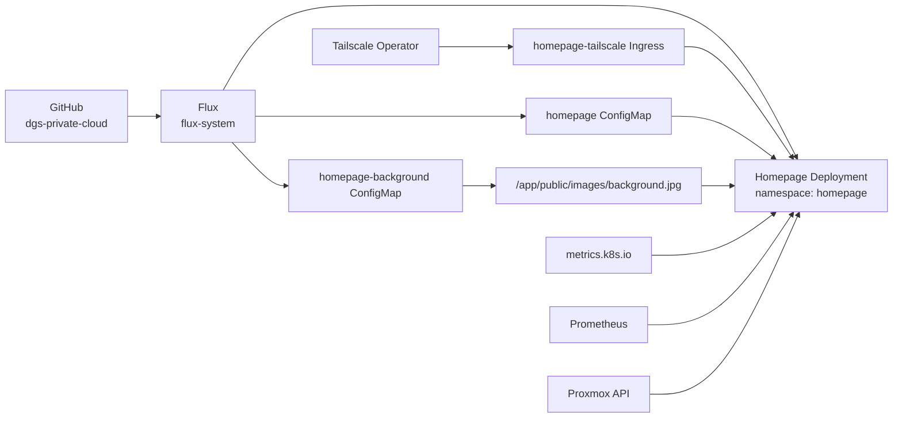

# Homepage Private Cloud Dashboard

## Status

**Final visual and operational checkpoint: 2026-08-19**

Homepage is an operational private service dashboard for the DGS Private Cloud. It is reconciled by Flux, exposed only through the Tailscale Kubernetes IngressClass, and validated on desktop, narrow-browser, and mobile/portrait layouts.

The final implementation preserves operational data as foreground content while using a restrained DGS-branded data-centre/cloud background.

## Verified runtime state

| Property | Verified state |
|---|---|
| Namespace | `homepage` |
| Deployment | `homepage`, `1/1` Ready |
| Pod | `1/1 Running`, zero restarts at final validation |
| Homepage image | `ghcr.io/gethomepage/homepage:v1.13.2` |
| Access | Private HTTPS through Tailscale Ingress |
| Ingress | `homepage-tailscale` |
| IngressClass | `tailscale` |
| Background ConfigMap | `homepage-background`, one binary data item |
| Flux Kustomization | `Ready=True` |
| Application startup | Next.js `16.2.6`, `Ready` |
| Public exposure | None; Tailscale Funnel remains disabled |

Exact tailnet DNS names are intentionally omitted from Git-managed documentation.

## GitOps architecture



## Git-managed resources

The Homepage Kustomization is under:

```text
clusters/beelink-talos/homepage/
```

The implementation contains:

- namespace and service-account resources;
- RBAC for the minimum cluster and Metrics API reads used by Homepage;
- the `homepage` ConfigMap with `settings.yaml`, `services.yaml`, `widgets.yaml`, `custom.css`, and related configuration;
- the Homepage Deployment and Service;
- `homepage-tailscale` Ingress;
- `homepage-background` ConfigMap containing the compressed dashboard background;
- the Homepage Kustomization entry used by the parent Flux reconciliation path.

## Dashboard content

### Header and live cluster metrics

The header displays:

- Talos cluster CPU and memory usage;
- control-plane CPU and memory usage;
- both worker-node CPU and memory usage;
- search;
- Melbourne weather;
- local date and time.

Kubernetes node metrics are sourced through the Metrics API. The metrics-server deployment and kubelet-serving certificate work completed before the final Homepage polish allow these values to be rendered without disabling kubelet certificate verification.

### Infrastructure

- **Proxmox VE** — VM/LXC counts plus CPU and memory statistics.
- **Kubernetes** — Talos Kubernetes cluster entry.
- **Tailscale** — private-network administration entry.

### Observability

- **Grafana** — metrics, logs, dashboards, and alerts.
- **Prometheus** — targets up/down/total.
- **Alertmanager** — firing, pending, and suppressed alert counts.
- **Loki** — ingest rate, log-line rate, and missing-entry metric.

### Websites

- Duminda Sumanasinghe portfolio.
- Nokzeo.

### DevOps and GitOps

- Jenkins.
- FluxCD.
- GitHub repository.

## Runtime-only values and secrets

No plaintext credentials are stored in Homepage Git-managed configuration.

Runtime data is supplied through Kubernetes Secrets, including:

- `homepage-runtime` for external/private URLs;
- `homepage-proxmox` for the Proxmox API token ID and token secret.

The Proxmox and Jenkins private tailnet URLs are referenced in `services.yaml` through `HOMEPAGE_VAR_*` variables rather than being committed literally.

Secret **names** may be documented; secret **values** must not be committed.

## Background implementation

The final background uses Homepage's native background setting:

```yaml
background:
  image: /images/background.jpg
  opacity: 55
```

The image is stored as a compressed JPEG in the Git-managed `homepage-background` ConfigMap and mounted into the container at:

```text
/app/public/images/background.jpg
```

The original high-resolution PNG remains local operator material and is not required in Git.

The background artwork intentionally keeps the centre relatively quiet so that live dashboard cards remain readable. DGS branding is placed in the upper-left portion of the image.

## Responsive visual treatment

The final CSS keeps the background fixed while moving the operational foreground below the DGS branding.

Desktop brand-safe spacing:

```css
#inner_wrapper {
  padding-top: 165px !important;
}
```

Mobile/narrow layout spacing:

```css
@media (max-width: 900px) {
  #inner_wrapper {
    padding-top: 150px !important;
  }
}
```

Background orientation is responsive:

- desktop: centred at the top;
- mobile/narrow layouts: aligned to the left/top so the DGS mark remains visible.

Service cards use the existing dark/glass treatment so live metrics remain the primary foreground content.

The Tailscale and GitHub service icons use high-contrast Simple Icons variants to remain visible against the dark cards.

## Final visual validation

Validated successfully in:

- full desktop browser layout;
- narrow/portrait desktop-browser layout;
- mobile portrait layout.

The final mobile layout confirms:

- DGS branding is visible;
- Talos metrics wrap without covering the branding;
- search, weather, and time remain usable;
- Infrastructure cards stack cleanly;
- Observability cards stack cleanly;
- Websites and DevOps/GitOps cards remain readable;
- Tailscale and GitHub icons have adequate contrast.

## Validation commands

```powershell
Set-Location "E:\home-server\dgs-private-cloud"

git status
flux get kustomizations -A

kubectl -n homepage get pods -o wide
kubectl -n homepage get deployment homepage
kubectl -n homepage get configmap homepage-background
kubectl -n homepage get ingress
kubectl -n homepage logs deployment/homepage --tail=40
```

Expected conditions:

- Git working tree clean;
- Flux Kustomization `Ready=True`;
- Homepage Deployment `1/1`;
- Homepage pod `1/1 Running`;
- `homepage-background` exists;
- `homepage-tailscale` Ingress exists;
- Next.js reports `Ready`.

## Safe manifest validation

Because `homepage-background` contains binary image data, client-side `kubectl apply` can attempt to create an oversized `kubectl.kubernetes.io/last-applied-configuration` annotation.

Use server-side apply for dry-run validation:

```powershell
kubectl kustomize .\clusters\beelink-talos\homepage |
kubectl apply `
  --server-side `
  --dry-run=server `
  --force-conflicts `
  --field-manager=homepage-validation `
  -f -
```

This is validation only. Flux remains the real field manager and deployment mechanism.

## Background replacement workflow

1. Keep the source artwork outside Git.
2. Compress it to a reasonably small JPEG.
3. Generate `homepage-background` declaratively:

```powershell
kubectl create configmap homepage-background `
  --namespace homepage `
  --from-file=background.jpg=<compressed-jpeg-path> `
  --dry-run=client `
  -o yaml
```

4. Write the generated YAML to `background-configmap.yaml`.
5. Run `git diff --check`.
6. Run the server-side dry-run validation.
7. Commit and push.
8. Reconcile Flux.
9. Restart Homepage.
10. Hard-refresh the browser and verify desktop/mobile presentation.

The ConfigMap is mounted using `subPath`, so a running pod does not automatically receive replacement image content. Restart the Deployment after changing the background:

```powershell
kubectl -n homepage rollout restart deployment/homepage
kubectl -n homepage rollout status deployment/homepage --timeout=5m
```

## Troubleshooting lessons

### Image is mounted but not displayed

Confirm that Homepage itself is serving the file:

```powershell
kubectl -n homepage exec deployment/homepage -- `
  node -e "fetch('http://127.0.0.1:3000/images/background.jpg').then(async r => { console.log(r.status, r.headers.get('content-type'), (await r.arrayBuffer()).byteLength) })"
```

Then confirm `settings.yaml` uses Homepage's native `background.image` setting.

### Large ConfigMap fails ordinary apply validation

If the error states that `metadata.annotations` is too long, use the server-side dry-run command documented above. Do not work around it by applying unmanaged resources directly to the live cluster.

### Background changed in Git but browser still shows old image

Reconcile Flux, restart the Homepage Deployment because of the `subPath` mount, and hard-refresh the browser.

### PowerShell file paths unexpectedly resolve under System32

For .NET file APIs such as `[System.IO.File]::ReadAllText`, use absolute paths rooted at:

```text
E:\home-server\dgs-private-cloud
```

This avoids dependency on the process working directory.

## OpenTelemetry tracing

Homepage HTTP tracing was added and verified on `2026-09-24`.

The trace path is:

```text
Homepage -> OpenTelemetry -> Grafana Alloy -> Tempo -> Grafana Explore
```

Because the stock Homepage image does not contain the required Node.js
OpenTelemetry auto-instrumentation packages, an init container installs:

```text
@opentelemetry/api@1.9.0
@opentelemetry/auto-instrumentations-node@0.80.0
```

The packages are stored in a shared `/otel` `emptyDir` and mounted read-only
into the Homepage container.

The important runtime settings are:

```text
OTEL_SERVICE_NAME=homepage
OTEL_TRACES_EXPORTER=otlp
OTEL_EXPORTER_OTLP_ENDPOINT=http://alloy.monitoring.svc.cluster.local:4318
OTEL_EXPORTER_OTLP_PROTOCOL=http/protobuf
OTEL_METRICS_EXPORTER=none
OTEL_LOGS_EXPORTER=none
OTEL_NODE_ENABLED_INSTRUMENTATIONS=http
NODE_PATH=/otel/node_modules
NODE_OPTIONS=--require @opentelemetry/auto-instrumentations-node/register
```

The Kubernetes readiness and liveness probes call `/api/healthcheck`, so
those requests generate trace spans automatically.

The verified Grafana TraceQL query is:

```traceql
{ resource.service.name = "homepage" && span.http.target = "/api/healthcheck" }
```

Tempo returned matching Homepage health-check spans and Grafana Explore
displayed live `GET` traces with millisecond durations.

The first instrumented rollout entered `CrashLoopBackOff` because
`NODE_OPTIONS` used a direct filesystem require path. The working solution
uses `NODE_PATH=/otel/node_modules` and requires the package by its exported
module name.

The shared Tempo/Alloy architecture is documented in
`18-observability-stack.md`.

## Security boundary

- Homepage remains private through Tailscale.
- Tailscale Funnel is not used.
- Exact private tailnet hostnames are kept out of Git.
- Proxmox tokens and runtime URLs remain in Kubernetes Secrets.
- Screenshots containing tailnet DNS names belong only in ignored/private evidence locations.
- No router public port-forward is required for Homepage.

## Final state

The Homepage visual-facelift task is complete as of `2026-08-19`.

Further Homepage changes should be driven by a functional requirement rather than additional background/layout experimentation. The next platform priorities are SOPS/age secret management, recovery testing, UPS telemetry, and later Jenkins build-agent/CI-to-GitOps work.
