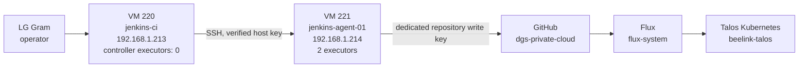

# Jenkins Build Agent and CI-to-GitOps Workflow

**Status:** Phase 1G baseline complete
**Verified:** 2026-08-24

## Scope

This phase separated Jenkins build execution from the Jenkins controller and
proved an end-to-end CI-to-GitOps path in which Jenkins changes Git while Flux
remains the only component that reconciles Kubernetes.

The validated responsibility split is:

```text
Jenkins -> CI, tests, Git changes and Git pushes
Flux    -> GitOps reconciliation and Kubernetes changes
```

Jenkins does not require Kubernetes administrator credentials for this
workflow and does not run `kubectl apply`.

## Architecture



The Jenkins controller remains privately reachable through the existing
Tailscale Serve path. Exact private tailnet hostnames and addresses remain out
of Git.

## Jenkins build-agent VM

| Property | Verified value |
|---|---|
| Proxmox VM ID | `221` |
| VM name / hostname | `jenkins-agent-01` |
| Role | Dedicated Jenkins build agent |
| OS | Ubuntu Server 26.04 LTS |
| CPU | 1 socket / 4 vCPU, CPU type `host` |
| Memory | 8 GiB |
| System disk | 80 GiB on `vmdata` |
| Machine | `q35` |
| BIOS | SeaBIOS |
| SCSI controller | VirtIO SCSI single |
| Network | VirtIO on `vmbr0` |
| LAN address | `192.168.1.214/24` by DHCP reservation |
| QEMU Guest Agent | Active |
| Start at boot | Enabled |
| Java | OpenJDK `21.0.11` |
| Git | `2.53.0` |
| Docker | `29.1.3` |
| Docker smoke test | `hello-world` successful |

The Ubuntu guided LVM layout was expanded so the root logical volume uses the
available VM disk rather than leaving roughly half of the volume group unused.

## Dedicated Jenkins operating-system account

A dedicated account named `jenkins` was created on VM `221`.

Verified state:

- home directory: `/home/jenkins`;
- shell: `/bin/bash`;
- local password locked;
- member of the `docker` group;
- Java, Git, and Docker available to the account;
- Docker `hello-world` runs successfully without `sudo`.

Membership in the Docker group is intentionally limited to this trusted,
dedicated build-agent VM because Docker access is effectively privileged.

## Controller-to-agent SSH trust

The controller uses a dedicated Ed25519 key for VM `221`.

Controls:

- controller key path: `/var/lib/jenkins/.ssh/jenkins-agent-01`;
- the private key is not committed;
- the matching public key is installed in
  `/home/jenkins/.ssh/authorized_keys` on VM `221`;
- the agent SSH host key was fingerprint-verified before being added to the
  controller's `known_hosts`;
- Jenkins uses the Known Hosts File verification strategy;
- passwordless controller-to-agent SSH was validated as the `jenkins` user.

The controller successfully verified the remote hostname, Java, Git, and
Docker versions before the node was registered in Jenkins.

## Jenkins node configuration

| Property | Value |
|---|---|
| Node name | `jenkins-agent-01` |
| Type | Permanent Agent |
| Remote root | `/home/jenkins` |
| Executors | `2` |
| Labels | `linux docker gitops` |
| Launch method | SSH |
| SSH target | `192.168.1.214:22` |
| Host verification | Known Hosts File |
| State | Online |

The Jenkins remoting JAR is copied and launched automatically over SSH. The
agent log confirmed `Agent successfully connected and online`.

After the distributed build was proven, the built-in Jenkins controller
executor count was set to `0`, keeping normal build execution off VM `220`.

## Build-agent smoke validation

Pipeline: `jenkins-agent-smoke`

The Pipeline was deliberately constrained to the agent labels and verified:

- `NODE_NAME=jenkins-agent-01`;
- workspace under `/home/jenkins/workspace/`;
- build user `jenkins`;
- OpenJDK 21;
- Git;
- Docker client and daemon access;
- `docker run --rm hello-world`.

A second run succeeded after controller executors were disabled, proving the
job was not falling back to the controller.

## GitHub write-access design

A separate repository-scoped Ed25519 deploy key was created for Jenkins.

GitHub deploy-key title:

```text
jenkins-gitops-write
```

Jenkins credential ID:

```text
github-dgs-private-cloud-write
```

The deploy key has repository write permission because the CI-to-GitOps
workflow must commit manifest changes. It is separate from:

1. the Flux repository key; and
2. the controller-to-agent SSH key.

GitHub's Ed25519 host fingerprint was verified before `github.com` was added to
`/home/jenkins/.ssh/known_hosts`.

The private key is stored as a Jenkins SSH credential and is injected into
Pipeline steps only when required. It must never be stored in Git, a
Jenkinsfile, screenshots, shell history, or documentation.

## Jenkins-to-GitHub validation sequence

### Read-only authentication

Pipeline: `jenkins-github-auth-smoke`

The Pipeline used the Jenkins SSH private-key credential and
`git ls-remote` to prove authenticated read access from VM `221`.

Result: `SUCCESS`.

### Repository clone

Pipeline: `jenkins-gitops-clone-smoke`

Validated:

- clone of `dgsuma/dgs-private-cloud`;
- branch `main`;
- clean working tree;
- correct SSH remote;
- local-only smoke file creation.

Result: `SUCCESS`.

### Local commit without push

The same controlled clone workflow configured:

```text
user.name  = DGS Jenkins CI
user.email = jenkins-ci@dgs-private-cloud.local
```

Jenkins created local commit:

```text
775f60c test(ci): verify Jenkins Git commit
```

The local branch was one commit ahead of `origin/main`; no push occurred.

Result: `SUCCESS`.

### Temporary write branch

Pipeline: `jenkins-github-write-smoke`

Jenkins created and pushed:

```text
jenkins/gitops-smoke-1
```

with commit:

```text
0876cda test(ci): verify Jenkins GitHub write access
```

`origin/main` remained unchanged during this test. The temporary branch was
deleted from GitHub after validation.

Result: `SUCCESS`.

## End-to-end CI-to-GitOps validation

A harmless Flux-managed validation resource was created under:

```text
clusters/beelink-talos/ci-gitops-smoke/
```

It contains:

- namespace `ci-gitops-smoke`;
- ConfigMap `ci-gitops-smoke`.

The manually established baseline was:

```yaml
data:
  message: "baseline-manual"
  build: "0"
  source: "manual"
```

Baseline Git commit:

```text
ec665690 test(gitops): add CI-to-GitOps smoke resource
```

Flux reconciled that commit successfully and created the namespace and
ConfigMap.

### Jenkins GitOps update

Pipeline: `jenkins-ci-gitops-smoke`

Jenkins then:

1. cloned `main`;
2. changed only
   `clusters/beelink-talos/ci-gitops-smoke/configmap.yaml`;
3. ran `git diff --cached --check`;
4. committed the change;
5. pushed the commit to `main`.

Jenkins commit:

```text
77bc93b test(gitops): Jenkins updates CI smoke ConfigMap
```

The resulting ConfigMap data in Git was:

```yaml
data:
  message: "updated-by-jenkins"
  build: "1"
  source: "jenkins"
```

## Automatic Flux reconciliation proof

No manual Flux reconcile command was run after the Jenkins push.

Flux subsequently reported both the GitRepository and Kustomization at:

```text
main@sha1:77bc93b
```

Kubernetes then reported:

```text
updated-by-jenkins
1
jenkins
```

from the live `ci-gitops-smoke/ci-gitops-smoke` ConfigMap.

The administration workstation then fast-forwarded to the same commit and
returned to a clean working tree.

This proves the complete chain:

```text
Jenkins Pipeline
    -> Git commit
    -> GitHub main
    -> Flux source detection
    -> Flux Kustomization apply
    -> Kubernetes state change
```

## Security boundary

The validated GitOps design intentionally does **not** give Jenkins direct
cluster administration credentials.

Do not place any of the following on the build agent for the normal CI path:

- kubeconfig;
- `talosconfig`;
- Flux private keys;
- Kubernetes service-account administrator tokens;
- Proxmox administrator credentials.

Jenkins changes Git. Flux changes Kubernetes.

The Jenkins GitHub write deploy key is a high-value credential and must remain
repository-scoped, separate from all other SSH keys, and protected by the
Jenkins credential store.

The controller remains at zero build executors. The build agent is trusted
infrastructure and is not intended for arbitrary untrusted jobs because the
`jenkins` account can access the Docker daemon.

## Recovery and rebuild notes

To rebuild the agent:

1. create VM `221` or a replacement VM with equivalent capacity;
2. install Ubuntu Server, OpenJDK 21, Git, Docker, and QEMU Guest Agent;
3. create the locked `jenkins` account and Docker-group membership;
4. restore controller-to-agent SSH trust with a new dedicated key if required;
5. verify the agent SSH host fingerprint;
6. register the node with `/home/jenkins` as the remote root;
7. restore labels `linux docker gitops` and two executors;
8. verify the GitHub host fingerprint;
9. restore the repository-scoped Jenkins credential from the approved secret
   source, not from Git;
10. rerun the agent and GitHub authentication smoke Pipelines.

If a Jenkins or GitHub SSH key is suspected to be exposed, revoke or remove it
and generate a replacement rather than reusing the old key.

## Current completion state

Phase 1G baseline is complete:

- [x] dedicated build-agent VM;
- [x] Java, Git, and Docker tooling;
- [x] dedicated Jenkins OS account;
- [x] secure controller-to-agent SSH;
- [x] Jenkins permanent agent online;
- [x] controller executors set to zero;
- [x] distributed Pipeline smoke test;
- [x] dedicated repository write credential;
- [x] read-only GitHub authentication;
- [x] clone and local-commit validation;
- [x] temporary-branch write validation;
- [x] temporary branch removed;
- [x] safe Flux-managed GitOps test resource;
- [x] Jenkins commit pushed to `main`;
- [x] automatic Flux reconciliation proven;
- [x] live Kubernetes state verified.

## Follow-on CI work

The next application-level CI iteration can build on this baseline:

1. keep application source and deployment responsibilities clearly separated;
2. build and test a real application on `jenkins-agent-01`;
3. scan the container image;
4. publish an immutable image to GHCR;
5. update an image tag or digest in the GitOps repository;
6. let Flux deploy the image;
7. add branch protection or a pull-request workflow before treating automatic
   writes to `main` as the normal production pattern.

The current `ci-gitops-smoke` resource is a validation fixture. It can be
removed later with a normal GitOps commit after its evidence is no longer
needed.
