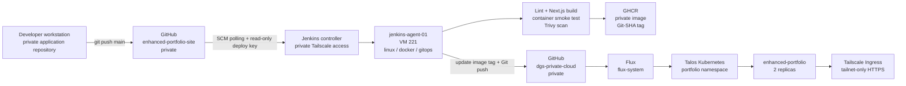

# Private Portfolio CI, GHCR, GitOps and Flux Delivery

## Status

**Completed and end-to-end verified on 2026-09-01.**

The real application delivery path is operational using the private
`dgsuma/enhanced-portfolio-site` source repository, Jenkins, private GHCR,
the private `dgsuma/dgs-private-cloud` GitOps repository, Flux, Talos
Kubernetes, and a private Tailscale Ingress.

The tested responsibility boundary is:

```text
Jenkins -> CI, image publication, and Git changes
Flux    -> Kubernetes reconciliation and pruning
```

Jenkins does not require a kubeconfig, `talosconfig`, Flux private key, or
Kubernetes administrator credential for the normal application-delivery path.

## End-to-end architecture



## Source repository

| Property | Verified state |
|---|---|
| Repository | `dgsuma/enhanced-portfolio-site` |
| Visibility | Private |
| Branch | `main` |
| Application | Next.js static export |
| Runtime image | Unprivileged Nginx |
| Jenkins job | `enhanced-portfolio-ci` |
| Trigger | Jenkins SCM polling |
| Source authentication | Repository-scoped read-only SSH deploy key |
| Host verification | Manually configured GitHub SSH host key |
| Jenkins source credential | `github-enhanced-portfolio-read` |

The source deploy key is intentionally read-only. Jenkins can clone the
application source but cannot write back to the source repository with this
credential.

## Build-agent execution

The Pipeline runs on `jenkins-agent-01` using the labels:

```text
linux docker gitops
```

The application build is containerized. Node.js does not need to be installed
directly on the build-agent VM.

The verified Pipeline stages are:

1. checkout;
2. build metadata;
3. application/container build;
4. container health smoke test;
5. Trivy vulnerability scan;
6. authenticated GHCR publication;
7. GitOps image-tag update.

## Container build

The application uses a multi-stage Docker build:

- Node 22 Alpine build stage;
- `npm ci`;
- ESLint;
- Next.js production/static-export build;
- unprivileged Nginx runtime;
- TCP `8080`;
- `/healthz` container health endpoint.

The Pipeline verifies `/healthz` inside the built container before registry
publication.

## Vulnerability scanning

Trivy runs before GHCR publication.

Policy at the 2026-09-01 checkpoint:

- HIGH and CRITICAL findings are reported;
- CRITICAL findings with fixes block the Pipeline;
- HIGH findings do not yet block the Pipeline.

At the final validation run, Trivy reported:

```text
HIGH:     4
CRITICAL: 0
```

The HIGH findings were OpenSSL package findings in the Alpine runtime and had
fixed package versions available. Base-image/package refresh remains a
hardening follow-up.

## Private GHCR publication

| Property | Verified state |
|---|---|
| Registry | `ghcr.io` |
| Image | `ghcr.io/dgsuma/enhanced-portfolio-site` |
| Visibility | Private |
| Tag model | First 12 characters of the application Git commit SHA |
| Jenkins write credential | `github-ghcr-write` |
| Kubernetes pull Secret | `portfolio/ghcr-pull` |
| Secret type | `kubernetes.io/dockerconfigjson` |

Image tags are treated as immutable by the Jenkins Pipeline. Before push,
Jenkins checks whether the Git-SHA tag already exists in GHCR:

- absent tag -> publish image;
- existing tag -> do not overwrite it.

A repeated build of the same application commit was tested successfully and
the existing image tag was preserved.

## Ephemeral Docker authentication

The Pipeline does not use a persistent `docker login` configuration.

For each build Jenkins creates:

```text
$WORKSPACE/.docker-ci/config.json
```

with permissions restricted to the build, sets `DOCKER_CONFIG` to that
directory, performs the GHCR registry operations, then deletes the complete
temporary directory from `post { always { ... } }`.

This removed the earlier Docker warning about credentials remaining in
`/home/jenkins/.docker/config.json`.

No GHCR token is committed to Git.

## GitOps write path

Jenkins changes the private GitOps repository through a separate,
repository-scoped SSH credential:

```text
github-dgs-private-cloud-write
```

The Pipeline clones:

```text
git@github.com:dgsuma/dgs-private-cloud.git
```

and changes only:

```text
clusters/beelink-talos/portfolio/kustomization.yaml
```

for a normal application release.

Example rendered image configuration:

```yaml
images:
  - name: ghcr.io/dgsuma/enhanced-portfolio-site
    newTag: <12-character-application-commit>
```

The Jenkins-generated commit format is:

```text
deploy(portfolio): <image-tag>
```

## Flux deployment

The application is active under:

```text
clusters/beelink-talos/portfolio/
```

Resources include:

- `namespace.yaml`;
- `deployment.yaml`;
- `service.yaml`;
- `portfolio-tailscale-ingress.yaml`;
- `kustomization.yaml`.

Flux reconciles `clusters/beelink-talos` from the private
`dgs-private-cloud` repository.

The Deployment uses:

```yaml
imagePullSecrets:
  - name: ghcr-pull
```

so Kubernetes can pull the private GHCR image without making the package
public.

## Runtime state

| Property | Verified state |
|---|---|
| Namespace | `portfolio` |
| Deployment | `enhanced-portfolio` |
| Replicas | `2/2` Ready |
| Service | Internal `ClusterIP`, TCP `80` |
| Container port | TCP `8080` |
| Image source | Private GHCR |
| IngressClass | `tailscale` |
| Exposure | Tailnet-only HTTPS |
| Funnel | Not used |

The two replicas were observed running across `talos-worker-01` and
`talos-worker-02`.

Exact tailnet hostnames and Tailscale addresses are intentionally not recorded
in Git.

## End-to-end proof

The final functional proof used a visible application content change:

```text
Available for DevOps, platform, cloud, and AI engineering opportunities
```

Only a normal source `git push` was performed.

The verified automatic path was:

1. Jenkins detected the private-source change through SCM polling;
2. Jenkins checked out the private repository using the read-only deploy key;
3. lint/build/container smoke test succeeded;
4. Trivy completed with zero CRITICAL findings;
5. Jenkins published a new immutable private GHCR image;
6. Jenkins committed the new image tag to `dgs-private-cloud`;
7. Flux detected and reconciled that GitOps commit without a manual
   `flux reconcile`;
8. Kubernetes completed a rolling Deployment update;
9. the new text appeared on the private Tailscale-hosted site.

This proves the complete unattended application-delivery path.

## CI/GitOps smoke workload retirement

The earlier `ci-gitops-smoke` ConfigMap existed only to prove the Jenkins ->
Git -> Flux responsibility split before a real application was available.

After the real portfolio workflow passed end-to-end:

- `clusters/beelink-talos/ci-gitops-smoke/` was removed;
- the root Kustomization reference was removed;
- Flux pruning was confirmed enabled;
- Flux pruned the obsolete smoke workload;
- the real portfolio remained `2/2` Ready.

The cleanup commit was:

```text
b59e30e chore(gitops): remove CI smoke workload
```

## Credential separation

The workflow deliberately uses separate credentials by responsibility:

| Credential / Secret | Purpose | Permission |
|---|---|---|
| `github-enhanced-portfolio-read` | Jenkins source checkout | Read-only deploy key |
| `github-ghcr-write` | Jenkins GHCR publication | Package write |
| `github-dgs-private-cloud-write` | Jenkins GitOps update | Repository-scoped write |
| `portfolio/ghcr-pull` | Kubernetes image pull | GHCR package read |
| Flux repository deploy key | Flux Git source | GitOps repository read |

Private keys, PAT values, registry tokens, kubeconfigs, `talosconfig`, and
Kubernetes Secret data must never be committed.

## Failure behaviour

The workflow is intentionally ordered so that a failed CI stage does not
advance the deployed GitOps image:

```text
checkout
  -> build
  -> smoke test
  -> security scan
  -> GHCR publication
  -> GitOps update
```

If build, health validation, or the CRITICAL vulnerability gate fails, the
GitOps image tag is not advanced.

Flux remains the only normal component that writes the desired Git state into
Kubernetes.

## Operational verification

### Jenkins

Confirm the application job ends with:

```text
Application CI -> GHCR -> GitOps completed successfully.
Finished: SUCCESS
```

### GitOps repository

```powershell
Set-Location "E:\home-server\dgs-private-cloud"

git pull --ff-only
git log -5 --oneline

Get-Content `
  .\clusters\beelink-talos\portfolio\kustomization.yaml
```

### Flux

```powershell
flux get kustomizations
```

Expected:

```text
flux-system ... READY=True
```

### Kubernetes

```powershell
kubectl -n portfolio get deployment,pods,service,ingress -o wide

kubectl -n portfolio rollout status `
  deployment/enhanced-portfolio `
  --timeout=5m
```

Expected:

```text
deployment "enhanced-portfolio" successfully rolled out
```

### Rendered image

```powershell
kubectl -n portfolio get deployment enhanced-portfolio `
  -o jsonpath='{.spec.template.spec.containers[0].image}'
```

The result must match the `newTag` committed under
`clusters/beelink-talos/portfolio/kustomization.yaml`.

## Recovery and rotation notes

### Source deploy key

If the private source deploy key is rotated:

1. create a replacement repository-scoped read-only deploy key;
2. install the public key on `enhanced-portfolio-site`;
3. replace the Jenkins SSH private-key credential;
4. validate checkout while retaining the old key;
5. remove the old deploy key only after validation.

### GHCR write token

If the Jenkins package-write token is rotated:

1. replace the secret value behind `github-ghcr-write`;
2. run the Pipeline;
3. verify `docker manifest inspect` and image publication;
4. revoke the previous token.

### Kubernetes GHCR read token

The `portfolio/ghcr-pull` Secret is manually managed at this checkpoint.

After rotating its package-read token:

```powershell
kubectl -n portfolio get secret ghcr-pull
kubectl -n portfolio rollout restart deployment/enhanced-portfolio
kubectl -n portfolio rollout status deployment/enhanced-portfolio
```

The target future state is to migrate this Secret to SOPS/age encrypted GitOps
management.

## Remaining hardening

1. Refresh the runtime base image/packages to clear the current HIGH OpenSSL
   findings.
2. Configure SOPS/age and migrate manually managed Secrets, including
   `portfolio/ghcr-pull`.
3. Consider branch protection or a pull-request promotion model for automated
   GitOps changes.
4. Consider digest pinning or signing/attestation if the homelab release
   process is later hardened further.
5. Perform the planned isolated VM restore and Talos disaster-recovery
   rehearsals.
