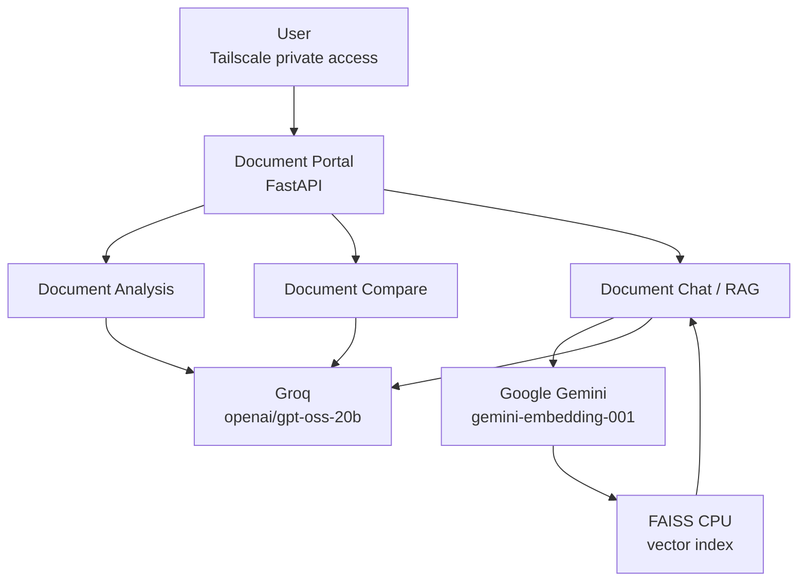
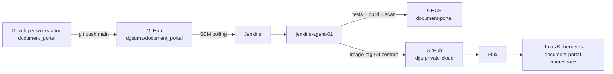

# Document Portal Groq Migration and Production Validation

**Status:** Complete and end-to-end verified
**Verified:** 2026-09-29

## Scope

This phase diagnosed a production Document Portal LLM failure, replaced the
generation workload with Groq `openai/gpt-oss-20b`, retained Google Gemini
embeddings for RAG, validated all application functions locally, deployed the
change through Jenkins and GitOps, and verified the complete production path.

The final responsibility split is:

```text
Google Gemini embedding API -> document embeddings for RAG
Groq GPT-OSS 20B           -> Analysis, Compare and Chat generation
FAISS CPU                   -> local vector retrieval
Jenkins                     -> CI, image publication and GitOps image updates
Flux                        -> Kubernetes reconciliation
```

No API-key values are stored in this repository.

## Final application architecture



The Google API key remains required because Document Chat uses Google for
embeddings even though generation has moved to Groq.

## Delivery architecture



Jenkins does not perform the normal Kubernetes deployment directly. It builds
and publishes the application image and updates Git. Flux remains responsible
for reconciling the declared Kubernetes state.

## Original production failure

Document Chat indexing was successful:

- the uploaded PDF was parsed;
- Google `models/gemini-embedding-001` generated embeddings;
- the FAISS CPU index was created;
- the retriever loaded successfully.

The failure occurred only when the RAG chain attempted generation using the
configured Google LLM.

The production logs reported a Gemini `429 ResourceExhausted` response for:

```text
generate_content_free_tier_requests
```

The affected generation model was:

```text
gemini-3.8-flash
```

The reported free-tier request limit had been exhausted. The application
wrapped the upstream provider exception and `/chat/query` returned HTTP 500.

This established that the primary fault was not:

- PDF ingestion;
- FAISS;
- the retriever;
- authentication;
- Kubernetes networking;
- the Document Chat UI.

The failure was the upstream generation quota.

## Provider implementation review

The runtime implementation was reviewed before changing configuration.

Supported generation providers in the current application are:

```text
google
groq
```

The currently supported embedding provider is:

```text
google
```

All three generation workflows use the shared model loader:

```text
Document Analysis
Document Compare
Document Chat
        |
        v
ModelLoader.load_llm()
```

The runtime provider is selected through:

```text
LLM_PROVIDER
```

Therefore changing `LLM_PROVIDER` changes generation for all three application
functions while leaving the Google embedding path independent.

## Groq model selection

The existing Groq configuration referenced:

```text
deepseek-r1-distill-llama-70b
```

The configured Groq model was changed to:

```text
openai/gpt-oss-20b
```

Application configuration:

```yaml
llm:
  groq:
    provider: "groq"
    model_name: "openai/gpt-oss-20b"
    temperature: 0
    max_output_tokens: 2048
```

Google embeddings remain:

```yaml
embedding_model:
  provider: "google"
  model_name: "models/gemini-embedding-001"
```

## Secure local Groq-key handling

The Groq API key was loaded into the current PowerShell process using a hidden
`SecureString` prompt.

The plaintext key was never pasted into:

- Git;
- YAML;
- Markdown;
- the ChatGPT conversation;
- a PowerShell command argument.

Only key-presence checks were printed.

The local environment used:

```text
GOOGLE_API_KEY              loaded
GROQ_API_KEY                loaded
DOCUMENT_PORTAL_API_TOKENS  loaded
LLM_PROVIDER                groq
```

## Direct Groq validation

An isolated `ChatGroq` invocation was performed before modifying application
configuration.

Validated model:

```text
openai/gpt-oss-20b
```

Result:

```text
CONTENT='GROQ_OK'
HTTP 200
finish_reason=stop
```

An explicit `reasoning_effort` compatibility difference was discovered between
the installed LangChain Groq integration and the current Groq API.

The application therefore does not force a `reasoning_effort` value. A normal
invocation without the explicit parameter succeeded.

## Application ModelLoader validation

After updating `config/config.yaml`, the application model loader itself was
tested rather than relying only on a direct SDK call.

Verified result:

```text
LLM_TYPE=ChatGroq
CONTENT='MODEL_LOADER_OK'
MODEL=openai/gpt-oss-20b
HTTP 200
```

This proved the complete local configuration path:

```text
LLM_PROVIDER=groq
        |
        v
config/config.yaml
        |
        v
ModelLoader
        |
        v
ChatGroq
        |
        v
openai/gpt-oss-20b
```

## Local functional validation

The complete application was launched locally with:

```text
uvicorn api.main:app --port 8083 --reload
```

All major functions were then tested.

### Document Analysis

Verified:

```text
provider=groq
model=openai/gpt-oss-20b
Groq HTTP 200
Metadata extraction successful
POST /analyze HTTP 200
```

### Document Compare

The validation PDFs contained a known amount difference.

The application correctly reported:

```text
Total Amount changed from LKR 10,000.00 to LKR 10,500.00
```

Verified:

```text
provider=groq
model=openai/gpt-oss-20b
Groq HTTP 200
Chain invoked successfully
POST /compare HTTP 200
```

### Document Chat

Indexing used:

```text
Google model: models/gemini-embedding-001
FAISS: CPU
```

The test question was:

```text
Tell me the transaction amount?
```

The answer was:

```text
The transaction amount is LKR 10,000.00.
```

Verified:

```text
POST /chat/index HTTP 200
FAISS retriever loaded successfully
provider=groq
model=openai/gpt-oss-20b
Groq HTTP 200
Chain invoked successfully
POST /chat/query HTTP 200
```

The FAISS GPU constructor warning is benign in this deployment because the
application intentionally uses `faiss-cpu` and CPU retrieval succeeded.

## Doc Chat Send-button visibility fix

During mobile and desktop validation, the Doc Chat `Send` button was functional
but visually blended into the dark page background.

The existing generic markup was:

```html
<button id="btn-ask" class="btn">Send</button>
```

The application already had a reusable primary-button style, so no duplicate
CSS was introduced.

The final markup is:

```html
<button id="btn-ask" class="btn primary">Send</button>
```

The button now uses the same highlighted blue treatment as other primary
actions and was visually verified on both desktop and mobile.

## Application source commit

The application changes were committed as:

```text
aea20e8 fix(chat): update Groq model and highlight send button
```

Files changed:

```text
config/config.yaml
templates/index.html
```

The previous responsive Document Compare fix remained in:

```text
d9f14e6 fix(ui): make document compare mobile responsive
```

## Jenkins CI validation

Jenkins detected the source change through SCM polling and checked out:

```text
aea20e8f11e47e7748817a3d4b7d85eaa6bed065
```

The pipeline used Python 3.11 on `jenkins-agent-01`.

The automated test result was:

```text
293 passed
13 warnings
```

The warnings were non-blocking deprecation warnings.

The container image was built and tagged as:

```text
ghcr.io/dgsuma/document-portal:aea20e8f11e47e7748817a3d4b7d85eaa6bed065
```

The image was successfully pushed to GHCR.

Jenkins then updated the GitOps deployment image and created:

```text
809fa28 deploy(document-portal): aea20e8f11e47e7748817a3d4b7d85eaa6bed065
```

The Jenkins run completed with:

```text
Finished: SUCCESS
```

## Trivy security follow-up

The Jenkins image scan used:

```text
--severity HIGH,CRITICAL
--ignore-unfixed
--exit-code 0
```

The scan reported Python-package findings:

```text
HIGH:     27
CRITICAL: 1
TOTAL:    28
```

Because the pipeline currently uses `--exit-code 0`, these findings are
reported but do not block deployment.

This is a separate security-maintenance task and was not mixed into the Groq
migration.

Future work should:

1. review each reported package and fixed version;
2. determine which findings affect runtime dependencies;
3. update dependencies in controlled batches;
4. rerun unit tests and image scanning;
5. consider making selected HIGH/CRITICAL findings deployment-blocking after
   the dependency baseline is clean.

## Production runtime Secret

The deployment consumes its runtime configuration through:

```yaml
envFrom:
  - configMapRef:
      name: document-portal-config
  - secretRef:
      name: document-portal-runtime
```

The runtime Secret is intentionally not committed to the GitOps repository.

The final Secret contains these key names:

```text
DOCUMENT_PORTAL_API_TOKENS
GOOGLE_API_KEY
GROQ_API_KEY
```

Only the key names were displayed during verification. The Secret values were
not printed.

The Groq key was added by creating a temporary JSON patch file containing the
base64-encoded value, using `kubectl patch`, and deleting the temporary file
immediately afterward.

The patch modified only:

```text
GROQ_API_KEY
```

Existing API-token and Google-key values were preserved.

## GitOps provider switch

The Document Portal ConfigMap originally contained:

```yaml
LLM_PROVIDER: google
```

It was changed to:

```yaml
LLM_PROVIDER: groq
```

GitOps commit:

```text
8c971f3 feat(document-portal): switch LLM provider to Groq
```

Flux reconciled the live ConfigMap and production verification returned:

```text
LLM_PROVIDER=groq
```

## Travel-administration RBAC boundary

The travel kubeconfig identity could read the required application resources
but could not directly patch or delete the deployment resources.

Verified examples:

```text
patch deployment/document-portal -> no
delete pods                       -> no
```

A server-side `kubectl apply --dry-run=server` also returned `Forbidden` for
resources that require patch/get privileges.

This was treated as an expected RBAC boundary rather than bypassed.

The deployment change was therefore made through Git and Flux.

## Controlled GitOps pod restart

Changing a ConfigMap or Secret does not modify environment variables already
loaded inside a running container.

The pod therefore needed to be recreated after both:

```text
LLM_PROVIDER=groq
```

and:

```text
GROQ_API_KEY
```

were available.

Because the travel identity could not restart or delete the pod directly, a
pod-template annotation was added through GitOps:

```yaml
annotations:
  dgs-private-cloud/restart-trigger: "groq-provider-switch"
```

Commit:

```text
24dbce1 chore(document-portal): restart pod for Groq provider switch
```

Changing the pod template caused Kubernetes to create a new ReplicaSet/pod.

The live Deployment subsequently contained:

```text
dgs-private-cloud/restart-trigger=groq-provider-switch
```

and the new pod continued using the intended image:

```text
ghcr.io/dgsuma/document-portal:aea20e8f11e47e7748817a3d4b7d85eaa6bed065
```

## Production validation

All three application paths were tested again after the production cutover.

### Production Document Analysis

Logs confirmed:

```text
GOOGLE_API_KEY loaded
GROQ_API_KEY loaded
provider=groq
model=openai/gpt-oss-20b
Groq HTTP 200
Metadata extraction successful
POST /analyze HTTP 200
```

Result:

```text
PASS
```

### Production Document Compare

Logs confirmed:

```text
provider=groq
model=openai/gpt-oss-20b
DocumentComparatorLLM initialized
Groq HTTP 200
Chain invoked successfully
POST /compare HTTP 200
```

Known comparison result:

```text
Total Amount changed from LKR 10,000.00 to LKR 10,500.00
```

Result:

```text
PASS
```

### Production Document Chat

Indexing logs confirmed:

```text
Google embedding model=models/gemini-embedding-001
POST /chat/index HTTP 200
```

Query logs confirmed:

```text
provider=groq
model=openai/gpt-oss-20b
FAISS retriever loaded successfully
Groq HTTP 200
Groq HTTP 200
Chain invoked successfully
POST /chat/query HTTP 200
```

Test question:

```text
Tell me the transaction amount?
```

Production answer:

```text
The transaction amount is LKR 10,000.00.
```

Result:

```text
PASS
```

## Final verified state

| Property | Verified value |
|---|---|
| Namespace | `document-portal` |
| Application source branch | `main` |
| Application commit | `aea20e8f11e47e7748817a3d4b7d85eaa6bed065` |
| Container image | `ghcr.io/dgsuma/document-portal:aea20e8f11e47e7748817a3d4b7d85eaa6bed065` |
| Generation provider | `groq` |
| Generation model | `openai/gpt-oss-20b` |
| Embedding provider | Google |
| Embedding model | `models/gemini-embedding-001` |
| Vector store | FAISS CPU |
| Runtime Secret | `document-portal-runtime` |
| GitOps provider commit | `8c971f3` |
| GitOps restart commit | `24dbce1` |
| Production Analysis | PASS |
| Production Compare | PASS |
| Production Chat | PASS |
| Desktop UI | Verified |
| Mobile UI | Verified |

## Rollback

If Groq generation must be disabled, the generation provider can be returned
to Google through GitOps.

Change:

```yaml
LLM_PROVIDER: groq
```

back to:

```yaml
LLM_PROVIDER: google
```

Then commit and push the GitOps change.

Because the provider is loaded as an environment variable, force a new pod
template revision after the ConfigMap reconciles. For example, replace the
existing restart-trigger value with a new descriptive value.

The Google API key must remain present because it is required by the current
embedding implementation regardless of which generation provider is active.

The Groq key can remain in the runtime Secret during a temporary rollback or
be removed separately if the provider is permanently retired.

## Operational notes

- Never commit API-key values to Git.
- `document-portal-runtime` is runtime-managed and is not declared in the
  current GitOps repository.
- `document-portal-config` is GitOps-managed.
- Changes to ConfigMap/Secret environment variables require a new pod.
- The travel kubeconfig intentionally has restricted mutation privileges.
- Use Git + Flux for normal declarative deployment changes.
- Google remains a production dependency while Gemini embeddings are used.
- Groq is now the production generation dependency.
- FAISS CPU warnings about missing GPU constructors are expected when no GPU
  FAISS backend is being used.
- Trivy dependency findings remain an open hardening task.
- Provider quota or availability failures should eventually be surfaced to the
  UI as provider-specific errors instead of generic HTTP 500 responses.

## Verified commit trail

Application repository:

```text
d9f14e6 fix(ui): make document compare mobile responsive
aea20e8 fix(chat): update Groq model and highlight send button
```

GitOps repository:

```text
809fa28 deploy(document-portal): aea20e8f11e47e7748817a3d4b7d85eaa6bed065
8c971f3 feat(document-portal): switch LLM provider to Groq
24dbce1 chore(document-portal): restart pod for Groq provider switch
```

## Outcome

The Document Portal is operational in production with a hybrid AI-provider
design:

```text
Google Gemini -> embeddings
FAISS         -> retrieval
Groq GPT-OSS  -> generation
```

Document Analysis, Document Compare and Document Chat were all validated
locally and then validated again against the production Kubernetes deployment.

The original Gemini generation-quota failure no longer blocks the three
generation workflows.
