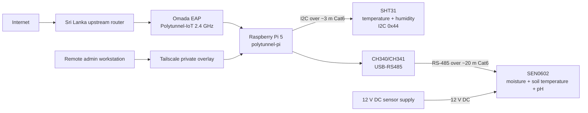

# Polytunnel Raspberry Pi 5 IoT Sensor Node

**Status:** Operational and remotely manageable
**Verified:** 2026-10-06

## Scope

This document records the verified Raspberry Pi 5 sensor-node installation used inside the Sri Lanka polytunnel. It covers the sensor wiring, Raspberry Pi interfaces, data-collection scripts, local CSV storage, systemd automation, backup workflow, Wi-Fi behaviour, and private remote administration through Tailscale.

The current deployment contains two sensor paths:

- **SHT31** for polytunnel air temperature and relative humidity.
- **SEN0602** for soil moisture, soil temperature, and soil pH over RS-485.

The SHT31 logger runs unattended. The SEN0602 workflow is currently manual because the probe is moved between grow bags before measurements are taken.

No Wi-Fi password, Tailscale node address, private SSH key, Tailscale authentication material, or other secret should be committed to this public repository.

## Verified current state

| Item | Verified state |
|---|---|
| Compute | Raspberry Pi 5, 8 GB |
| Hostname | `polytunnel-pi` |
| Operating system | Raspberry Pi OS / Debian-based userspace |
| Local Wi-Fi | `Polytunnel-IoT`, 2.4 GHz |
| Observed LAN lease | `192.168.1.12` on 2026-10-06 |
| LAN addressing | DHCP; lease may change |
| Remote administration | OpenSSH over private Tailscale connectivity |
| Tailscale service | Enabled and active |
| SSH service | Enabled and active |
| Wi-Fi autoconnect | Enabled for `Polytunnel-IoT` |
| SHT31 interface | I2C bus `/dev/i2c-1`, address `0x44` |
| SEN0602 interface | USB-RS485 CH340/CH341 at `/dev/ttyUSB0` |
| SEN0602 serial settings | Modbus RTU, 9600 baud, 8N1, slave ID `1` |
| SHT31 logging | Automatic, approximately every five minutes |
| SEN0602 logging | Manual validated measurement workflow |
| Local backup | Daily systemd timer plus manual on-demand backup |
| Backup integrity | SHA-256 checksum generated for each archive |

The LAN address is not used as the primary remote-management identity. Remote administration is performed over Tailscale, so a future change to the `192.168.1.x` DHCP lease does not by itself break remote SSH access.

## Architecture



## SHT31 wiring

The SHT31 is connected to the Raspberry Pi through approximately 3 m of Cat6. The installation has been validated with repeated CRC-checked sensor reads.

| Raspberry Pi | Function | Cat6 conductor | SHT31 |
|---|---|---|---|
| Pin 3 / GPIO2 | SDA | White/Orange | SDA |
| Pin 5 / GPIO3 | SCL | White/Green | SCL |
| Pin 1 | 3.3 V | White/Blue | VCC |
| Pin 6 | GND | Orange | GND |

The solid Green and solid Blue conductors are also bonded as additional ground returns in the installed cable, giving three ground conductors in total.

### Important electrical boundary

The SHT31 is a **3.3 V sensor path**. Do not apply the SEN0602 12 V supply to the SHT31 or to Raspberry Pi GPIO power pins.

### I2C validation

```bash
ls -l /dev/i2c-*
sudo i2cdetect -y 1
```

Expected result: device address `44` appears on bus 1.

The installed logger validates the SHT31 CRC using polynomial `0x31` with initial value `0xFF`.

## SEN0602 wiring

The SEN0602 uses its own 12 V DC supply and communicates with the Pi through a USB-RS485 adapter. The approximately 20 m Cat6 run uses one twisted pair for the RS-485 differential signal.

| SEN0602 wire | Function | Cat6 conductor | Destination |
|---|---|---|---|
| Brown | VCC | White/Blue | +12 V DC supply |
| Black | GND | Blue | 12 V negative and USB-RS485 GND common |
| Yellow | RS485-A | White/Orange | USB-RS485 A |
| Blue | RS485-B | Orange | USB-RS485 B |

The 12 V supply powers the SEN0602 only. The Raspberry Pi is powered by its own approved Pi power supply.

### USB-RS485 validation

The adapter is currently detected as:

```text
/dev/ttyUSB0
```

Useful checks:

```bash
ls -l /dev/ttyUSB0
lsusb
groups dgsadmin
```

The `dgsadmin` account is a member of `dialout`, so normal SEN0602 reads do not require `sudo`.

## SEN0602 Modbus mapping

The verified Modbus RTU request used to read four holding registers from slave ID `1` is:

```text
01 03 00 00 00 04 44 09
```

A valid response is 13 bytes long and is checked with the Modbus CRC.

| Register | Measurement | Conversion |
|---:|---|---|
| 0 | Soil moisture | raw / 10 = `%` |
| 1 | Soil temperature | signed raw / 10 = `°C` |
| 2 | Reserved / not used by current logger | — |
| 3 | Soil pH | raw / 10 |

## Sensor software and data paths

### SHT31 automatic logger

Script:

```text
/home/dgsadmin/sht31_logger.py
```

CSV output:

```text
/home/dgsadmin/sensor-data/sht31.csv
```

CSV header:

```text
datetime,air_temperature_c,relative_humidity_percent
```

systemd units:

```text
/etc/systemd/system/sht31-logger.service
/etc/systemd/system/sht31-logger.timer
```

Timer configuration:

```ini
OnBootSec=2min
OnUnitActiveSec=5min
Persistent=true
```

Operational checks:

```bash
systemctl is-active sht31-logger.timer
systemctl list-timers sht31-logger.timer --no-pager
tail -n 10 ~/sensor-data/sht31.csv
```

### SEN0602 validated manual measurement

Script:

```text
/home/dgsadmin/sen0602_measure.py
```

Run:

```bash
python3 ~/sen0602_measure.py
```

CSV output:

```text
/home/dgsadmin/sensor-data/sen0602.csv
```

CSV header:

```text
datetime,location,moisture_percent,soil_temperature_c,ph,ph_min,ph_max
```

The current workflow:

1. asks for a grow-bag/location label;
2. ignores the first 30 seconds after insertion;
3. samples every 5 seconds;
4. evaluates a rolling 12-sample stability window;
5. allows up to 360 seconds to settle;
6. captures 10 final readings after stability;
7. writes the averaged validated result to CSV.

Current stability thresholds:

```text
pH spread          <= 0.10
moisture spread    <= 1.0 %
temperature spread <= 0.3 °C
```

This measurement is intentionally **not scheduled automatically** at present because the single probe is moved between grow bags.

## Data directory

```text
/home/dgsadmin/sensor-data/
```

Key files:

```text
sht31.csv
sen0602.csv
README.txt
archive/
```

## Backup workflow

Local backup directory:

```text
/home/dgsadmin/sensor-backups/
```

Backup script:

```text
/home/dgsadmin/sensor_backup.sh
```

systemd units:

```text
/etc/systemd/system/polytunnel-sensor-backup.service
/etc/systemd/system/polytunnel-sensor-backup.timer
```

The timer runs daily and uses `Persistent=true`. The backup script creates a timestamped `tar.gz` archive and a matching SHA-256 checksum file. Archives older than 14 days are removed by the current retention rule.

Manual backup:

```bash
~/sensor_backup.sh
```

Check the schedule:

```bash
systemctl is-active polytunnel-sensor-backup.timer
systemctl list-timers polytunnel-sensor-backup.timer --no-pager
```

Check integrity:

```bash
cd ~/sensor-backups
sha256sum -c polytunnel-sensors-YYYYMMDD-HHMMSS.tar.gz.sha256
```

A final pre-departure archive created on 2026-10-06 was copied to the administration laptop and independently SHA-256 verified, confirming the off-device copy matched the Pi archive.

## Private remote administration

The Pi is registered as a Tailscale node and OpenSSH is enabled. The administration workstation uses an SSH alias:

```powershell
ssh polytunnel-pi
```

The alias resolves to the Pi's private Tailscale address in the workstation's local SSH configuration. The exact Tailscale address should remain outside the public repository.

Verified service state:

```bash
systemctl is-enabled ssh
systemctl is-active ssh
systemctl is-enabled tailscaled
systemctl is-active tailscaled
```

Wi-Fi autoconnect validation:

```bash
nmcli -t -f NAME,TYPE,AUTOCONNECT connection show
nmcli device status
```

Expected active Wi-Fi profile:

```text
Polytunnel-IoT
```

The Pi was reboot-tested while the administration laptop used an independent mobile-data connection. Wi-Fi, Tailscale, and SSH returned automatically and remote login succeeded.

### DHCP behaviour

`192.168.1.12` is the LAN lease observed during the 2026-10-06 validation. It is not treated as a permanent remote-management address.

A DHCP reservation may be added later for easier LAN troubleshooting, but it is not required for Tailscale remote administration.

## Remote data retrieval

The administration laptop has a separate restricted read-only SFTP key for sensor-data retrieval. That private key remains outside Git.

The workstation-only helper script downloads:

```text
sensor-data/sht31.csv
sensor-data/sen0602.csv
```

The read-only backup/data key and unrestricted administration key are separate credentials.

## Operational validation

```bash
echo "=== REMOTE ACCESS ==="
systemctl is-active tailscaled
tailscale ip -4

echo
echo "=== SHT31 LOGGER ==="
systemctl is-active sht31-logger.timer
systemctl list-timers sht31-logger.timer --no-pager
tail -n 3 ~/sensor-data/sht31.csv

echo
echo "=== DAILY BACKUP ==="
systemctl is-active polytunnel-sensor-backup.timer
systemctl list-timers polytunnel-sensor-backup.timer --no-pager

echo
echo "=== DISK SPACE ==="
df -h /
```

At the 2026-10-06 checkpoint:

- Tailscale was online.
- SHT31 logging was continuing automatically.
- The daily backup timer was active.
- The root filesystem had ample free space.
- Wi-Fi autoconnect was enabled.
- Passwordless administration through the dedicated admin key worked.
- Read-only remote SFTP data retrieval worked.
- A reboot from an independent mobile-data path recovered remote access.

## Safe power operations

For a planned local shutdown:

```bash
sudo shutdown -h now
```

After the Pi has halted, the SEN0602 12 V sensor supply can be turned off, followed by Pi power if required.

For startup, restore Pi power and then the SEN0602 12 V supply.

Do **not** issue a remote shutdown when nobody is physically available to restore power. A remote reboot is safer when remote recovery has already been validated.

## Security boundary

The public repository should exclude:

- Wi-Fi passwords;
- exact Tailscale node IP addresses and tailnet DNS suffixes;
- SSH private keys;
- Tailscale authentication keys;
- complete `authorized_keys` contents;
- backup archives;
- raw private network exports.

Only non-secret implementation details and validation commands belong in Git.

## Current limitations and next phase

The verified sensor-collection baseline is complete. The following work is **Planned**, not yet implemented:

- central database ingestion for historical sensor data;
- a Grafana or application dashboard for polytunnel trends;
- alerting for temperature, humidity, pH, or moisture thresholds;
- unattended SEN0602 logging if the probe is later left permanently in one grow bag;
- off-Pi scheduled backup replication that does not depend on the administration laptop being online;
- optional DHCP reservation for the Pi's LAN address.

Until those items are implemented, SHT31 collection remains automatic and the single SEN0602 probe remains a manual, location-labelled measurement workflow.
