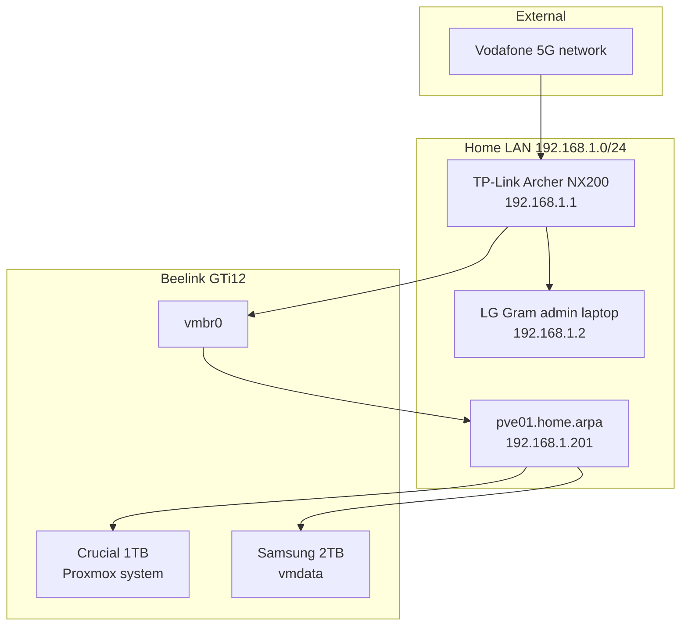

# Architecture Diagram

```mermaid
flowchart TB
    subgraph WAN["External"]
        Vodafone["Vodafone 5G network"]
    end

    subgraph LAN["Home LAN 192.168.1.0/24"]
        Router["TP-Link Archer NX200<br/>192.168.1.1"]
        Laptop["LG Gram admin laptop<br/>192.168.1.2"]
        PVE["pve01.home.arpa<br/>192.168.1.201"]
    end

    subgraph Host["Beelink GTi12"]
        Bridge["vmbr0"]
        Sys["Crucial 1TB<br/>Proxmox system"]
        VMStore["Samsung 2TB<br/>vmdata"]
    end

    Vodafone --> Router
    Router --> Laptop
    Router --> Bridge
    Bridge --> PVE
    PVE --> Sys
    PVE --> VMStore
```
