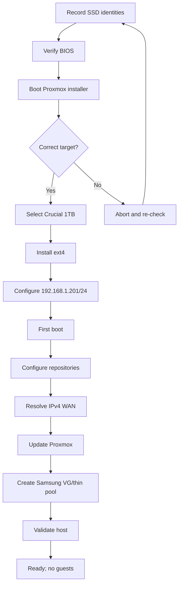

# Installation Flow

```mermaid
flowchart TD
    A["Record SSD identities"]
    B["Verify BIOS"]
    C["Boot Proxmox installer"]
    D{"Correct target?"}
    E["Select Crucial 1TB"]
    F["Abort and re-check"]
    G["Install ext4"]
    H["Configure 192.168.1.201/24"]
    I["First boot"]
    J["Configure repositories"]
    K["Resolve IPv4 WAN"]
    L["Update Proxmox"]
    M["Create Samsung VG/thin pool"]
    N["Validate host"]
    O["Ready; no guests"]

    A --> B --> C --> D
    D -->|Yes| E --> G --> H --> I --> J --> K --> L --> M --> N --> O
    D -->|No| F --> A
```
