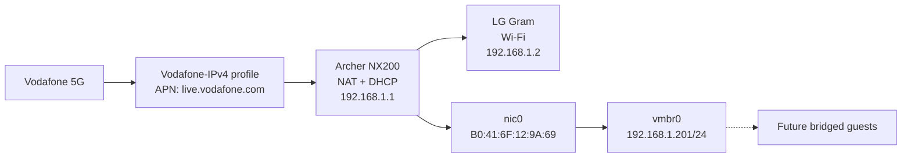

# Network Topology

```mermaid
flowchart LR
    Carrier["Vodafone 5G"]
    PDP["Vodafone-IPv4 profile<br/>APN: live.vodafone.com"]
    NX["Archer NX200<br/>NAT + DHCP<br/>192.168.1.1"]
    WiFi["LG Gram<br/>Wi-Fi<br/>192.168.1.2"]
    Ethernet["nic0<br/>B0:41:6F:12:9A:69"]
    Bridge["vmbr0<br/>192.168.1.201/24"]
    FutureVMs["Future bridged guests"]

    Carrier --> PDP --> NX
    NX --> WiFi
    NX --> Ethernet --> Bridge
    Bridge -.-> FutureVMs
```
