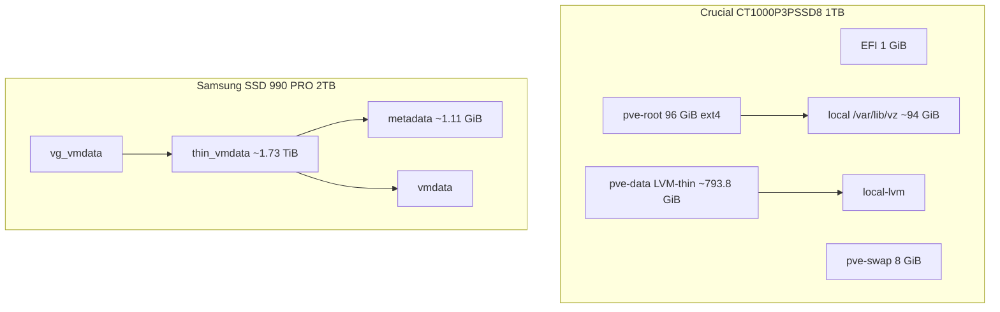

# Storage Layout

```mermaid
flowchart TB
    subgraph Crucial["Crucial CT1000P3PSSD8 1TB"]
        EFI["EFI 1 GiB"]
        ROOT["pve-root 96 GiB ext4"]
        SWAP["pve-swap 8 GiB"]
        DATA["pve-data LVM-thin ~793.8 GiB"]
        LOCAL["local /var/lib/vz ~94 GiB"]
        LOCALLVM["local-lvm"]
        ROOT --> LOCAL
        DATA --> LOCALLVM
    end

    subgraph Samsung["Samsung SSD 990 PRO 2TB"]
        VG["vg_vmdata"]
        POOL["thin_vmdata ~1.73 TiB"]
        META["metadata ~1.11 GiB"]
        STORE["vmdata"]
        VG --> POOL
        POOL --> META
        POOL --> STORE
    end
```
