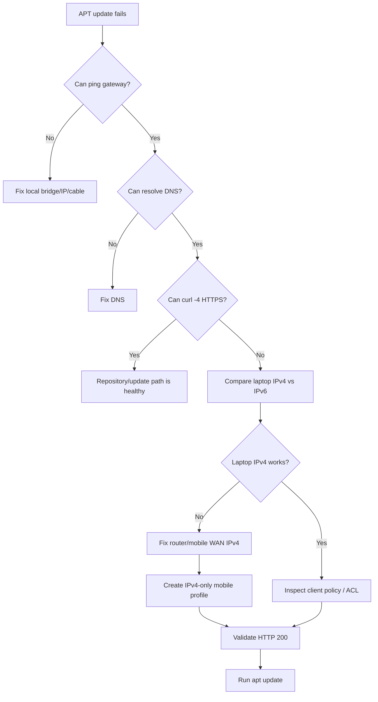

# Connectivity Troubleshooting Flow

```mermaid
flowchart TD
    A["APT update fails"]
    B{"Can ping gateway?"}
    C["Fix local bridge/IP/cable"]
    D{"Can resolve DNS?"}
    E["Fix DNS"]
    F{"Can curl -4 HTTPS?"}
    G["Repository/update path is healthy"]
    H["Compare laptop IPv4 vs IPv6"]
    I{"Laptop IPv4 works?"}
    J["Fix router/mobile WAN IPv4"]
    K["Inspect client policy / ACL"]
    L["Create IPv4-only mobile profile"]
    M["Validate HTTP 200"]
    N["Run apt update"]

    A --> B
    B -->|No| C
    B -->|Yes| D
    D -->|No| E
    D -->|Yes| F
    F -->|Yes| G
    F -->|No| H --> I
    I -->|No| J --> L --> M --> N
    I -->|Yes| K --> M
```
